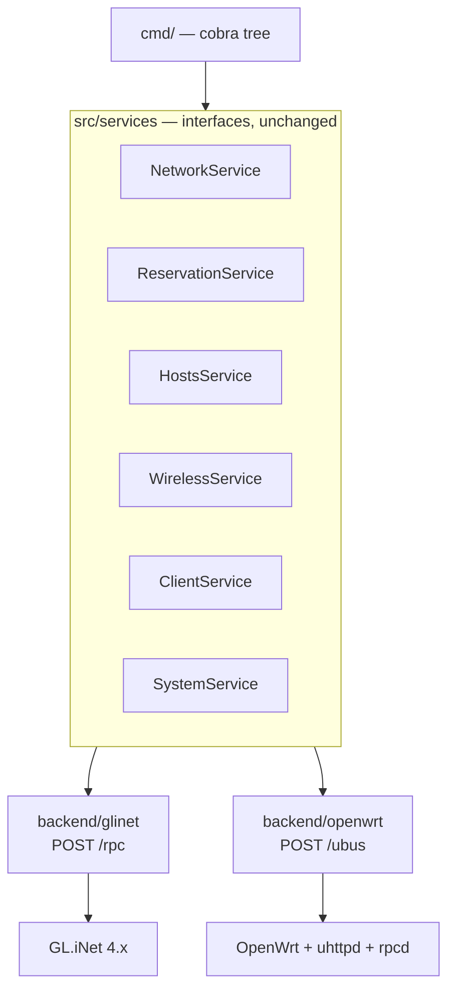

# gogl v2: one binary, two backends

**Status:** specification. Phase 2 complete, phase 1 partly complete. Written 2026-07-30.
See [Phases](#phases) for exactly what has landed.

Supersedes the four-utility layout for the CLI surface only. The library under `src/` keeps its
shape; `src/services` interfaces and `src/types` are the seam this design leans on.

---

## What changes and why

**One binary, `gogl <area> <action>`.** Four binaries meant four flag parsers, four help texts,
and four copies of the connection flags. Noun-verb is what git, docker, kubectl and gh converged
on, and it scales to the ~35 leaf commands this surface needs.

**The gofi mirror stops being a design constraint.** It existed so that knowing `gofips` meant
knowing `goglps`. That was worth something and it has been paid; it is not worth declining a
fourth capability or a better command tree. The ISC DHCP host-declaration format **stays**, on
its own merits: it diffs, it reviews, it lives in git, and `gofips --get | gogl lan reservations
import -` remains useful with no compatibility promise attached.

**Two HTTP backends behind the existing service interfaces.** GL.iNet's `POST /rpc` for GL.iNet
4.x, and UCI over `POST /ubus` for stock OpenWrt. See [Backends](#backends).

**Configuration moves to TOML under XDG paths**, with named routers and a password command.

---

## Non-goals

- **No SSH, still** — but for the reason in Critical Rule 5 as reworded, which is about structure
  rather than protocol. If `/ubus` proves unavailable on a device we care about, the safe form is
  `ubus call` with JSON on stdin, never interpolated `uci set`.
- **No root on the operator's machine.** Nothing this tool does needs it; it installs to
  `~/.local/bin`.
- **Not a full router backup.** `gogl profile` captures a network, not a device. `sysupgrade -b`
  over SSH remains the right tool for a byte-exact restore, and always will be.

---

## Command tree

Verified column: whether the underlying endpoint has been exercised against real hardware. It is
the scheduling input, not a wish list.

| Command | GL.iNet | OpenWrt |
|---|---|---|
| `gogl lan show [--guest]` | verified | untested |
| `gogl lan set [--guest] --ip --mask --pool-start --pool-end [--force]` | verified | untested |
| `gogl lan leases` | verified | untested |
| `gogl lan reservations list` | verified | untested |
| `gogl lan reservations add --name --mac --ip` | verified | untested |
| `gogl lan reservations rm --name\|--mac\|--ip` | verified | untested |
| `gogl lan reservations clear` | verified | untested |
| `gogl lan reservations export` | verified | untested |
| `gogl lan reservations import <file> [--prune] [--dry-run]` | verified | untested |
| `gogl lan dns show` | verified | untested |
| `gogl lan dns set --domain <d>` | workaround | **native** |
| `gogl lan dns add <name> <ip>` / `rm <name>` / `clear` | verified | untested |
| `gogl radio list` / `show --band 5` | verified | untested |
| `gogl radio set --band 5 --channel --width --hwmode --power` | verified | untested |
| `gogl wifi list` / `show --band 5 [--guest]` | verified | untested |
| `gogl wifi set --band 5 [--guest] --ssid --passphrase --encryption --hidden --enabled` | verified | untested |
| `gogl clients list [--band 5\|--wired] [--reserved]` | verified | untested |
| `gogl clients vendor <mac>` | offline | offline |
| `gogl profile export [--with-keys]` / `import <file> [--wireless]` | verified | untested |
| `gogl system info` | verified | untested |
| `gogl system reboot` | **not captured** | untested |
| `gogl access check` | verified | untested |
| `gogl access passwd` | **not captured** | untested |
| `gogl access users list\|add\|rm` | **not captured** | n/a |
| `gogl wan show` | **not captured** | untested |
| `gogl wan set-mode dhcp\|static\|pppoe` | **not captured** | untested |
| `gogl wan repeater scan\|connect` | **not captured** | n/a |
| `gogl wan tethering show` / `wan modem show` | **not captured** | n/a |
| `gogl config show` / `routers` / `init` | local | local |
| `gogl completion bash\|zsh\|fish` | free | free |

`lan reservations` accepts `res` as an alias, since four words before an argument is a lot.

### Verb vocabulary, held strictly

| Verb | Means |
|---|---|
| `list` | many items |
| `show` | one thing, in detail |
| `set` | write fields on a thing |
| `add` / `rm` | collection membership |
| `clear` | empty a collection |
| `import` / `export` | file in, file out |
| `check` | verify without changing |

Banned: `get` (ambiguous with `show`), `del`/`delete` (pick `rm`), `create` (use `add`), `update`
(use `set`).

This is why `lan dns set --domain X` is a field write and `lan dns add nas 192.168.8.13` is a
member add. One verb, one meaning, everywhere.

### Band abstraction

`--band 2.4|5|6` resolves to a device at runtime by reading the band each radio reports. Not a
static map: newer models have a third radio, and nothing guarantees `radio0` is 2.4GHz across the
product line. If two radios report the same band, `--device` becomes required rather than gogl
guessing.

The same resolution serves `wifi`, where interface names are worse than device names:
`--band 5` finds `default_radio1`, `--band 5 --guest` finds `guest5g`.

### Guest

A `--guest` flag on `lan` and `wifi`, not an area. Both backends model guest the same way gogl
will: an interface variant. GL.iNet returns `lan` and `guest` from `lan.get_config_list`; UCI has
separate `interface` and `wifi-iface` sections. One concept, two facets, no duplicated verbs.

---

## Backends



The service interfaces are already semantic rather than wire-shaped, which is what makes this
possible without redesigning them. A second backend is **not** a transport swap: "read the LAN
config" is one `lan.get_config_list` call on GL.iNet and a `uci get` on `network` plus one on
`dhcp` under OpenWrt. So each backend implements the service interfaces itself and shares only
`src/types` and the CLI.

### Why both are HTTP

59% of GL.iNet's 313 methods wrap standard OpenWrt or Linux subsystems; 41% are their own
inventions (`cloud`, `s2s`, `rtty`, `nas_web`, the hardware groups, their WAN-source
abstraction). **Every group gogl touches is in the first bucket** — `lan`, `dns`, `wifi`,
`clients`, `network`, `system` are UCI `network`, `dhcp`, `wireless` and the `hosts(5)` file.

So the domain model is OpenWrt. Only the plumbing is GL.iNet's, and `/ubus` supplies the other
plumbing over the same protocol with the same mockability.

### Divergences to expect

Same concept, different representation. These are the ones already known:

| Concept | GL.iNet API | UCI |
|---|---|---|
| DHCP pool | `start` + `end`, both addresses | `start` + `limit`, an offset and a **count** |
| Channel width | `20`, `40`, `80`, `auto` | `htmode`: `HT20`, `VHT80`, `HE80` |
| dnsmasq domain | **absent** | `dhcp.@dnsmasq[0].domain` |
| Hardware mode | `11a/n/ac`, slash-joined | `hwmode`: `11a`, plus `htmode` carrying the rest |
| Static lease | `static_bind`: `mac`, `ip`, `name` | `config host`: `mac`, `ip`, `name` |

The pool one is a real translation, not a rename, and getting it wrong yields a DHCP server that
serves the wrong range. The width vocabulary is why `VHT80` felt natural and was wrong on
GL.iNet — that was UCI convention leaking into a GL.iNet API.

### The domain workaround becomes backend-specific

gogl carries its DNS domain in a marker line inside the host file because GL.iNet exposes no
domain setter and `/ubus` is 404 on the SFT1200. Under the OpenWrt backend that hack is
unnecessary: set `dhcp.@dnsmasq[0].domain` and dnsmasq appends the suffix itself.

So the marker line is a GL.iNet workaround, not a design. `HostsService.SetDomain` stays in the
interface; the two backends implement it differently, and the OpenWrt one is the honest version.

### Three wire artifacts must leave `src/types`

`src/types` is meant to be vendor-neutral and currently is not:

- **`IntBool`** exists only because GL.iNet sends `enable: 1` rather than `true`
- **`HTModes`** is GL.iNet's capability object, with the narrower-widths inference on top
- **`BeginMarker` / domain-in-marker-line** is a workaround for a GL.iNet gap

All three belong in `backend/glinet`. Cheap now, expensive after a second backend exists.

---

## Configuration

`${XDG_CONFIG_HOME:-~/.config}/gogl/config.toml`:

```toml
default = "player-test"
output  = "text"            # or "json"

[routers.player-test]
host             = "192.168.8.1"
backend          = "glinet"      # or "openwrt"; default: probe
domain           = "herlein.me"
password_command = "pass show routers/player-test"

[routers.openwrt-one]
host    = "192.168.1.1"
backend = "openwrt"
```

`gogl --router openwrt-one lan show`, or omit `--router` for the default.

**Password resolution, highest wins:** `--password-command` flag, `GL_PASSWORD` env,
`password_command` in TOML, interactive prompt without echo. Never a `--password` flag: a secret
on argv is visible in `ps` and lands in shell history, which is the rule this project already
holds for the router password and violated for `--set-key`.

`password_command` executes a command named in a file the user owns at `0600` — the same trust
model as `git`'s `credential.helper` and `restic`'s `--password-command`.

**Backend detection.** With `backend` unset, probe: `POST /rpc` with a `challenge` call, then
`POST /ubus` with a `session.login`. Cache the answer in the TOML on first success rather than
probing every run.

### Paths

| What | Where |
|---|---|
| Config | `${XDG_CONFIG_HOME:-~/.config}/gogl/config.toml` |
| OUI cache | `${XDG_CACHE_HOME:-~/.cache}/gogl/oui.txt` |
| Install | `~/.local/bin/gogl` |

The OUI database currently sits under `XDG_DATA_HOME`, which is wrong — it is a re-downloadable
cache, not user data. Install currently targets `~/bin`; `~/.local/bin` is on `PATH` by default
via systemd and Debian's `.profile`.

### Global flags

`--router`, `-H/--host`, `-p/--port`, `--https`, `--insecure`, `--output text|json`, `--yes`.
Per-command where they mean something: `--dry-run`, `--force`, `--guest`, `--band`, `--device`.

**Exit codes:** `0` success, `1` error, `2` usage, `3` refused by a guard. The last one lets a
script distinguish "I was blocked" from "it broke", which matters for the domain and reservation
guards.

---

## Secrets on the command line

`--passphrase` with no value prompts without echo; `--passphrase-command` reads it from a
command. Never a bare `--passphrase <value>`.

Named `--passphrase` rather than `--password` so that `gogl access passwd` — the router's own
password — cannot be confused with a WiFi key.

This is a fix, not a new rule: `goglnet --set-key 'value'` put a WiFi passphrase in argv and in
shell history, contradicting the reason `GL_PASSWORD` was never given a flag.

---

## Implementation strategy

**The library does not change.** `src/services`, `src/transport`, `src/auth` and `src/mock` keep
their shapes.

**The four utilities became importable packages** rather than being merged into one. Merging four
`package main`s would have meant renaming ~15 colliding identifiers -- `formatText`, `formatJSON`,
`mockClient`, `isConnectionLost`, `stubNetwork`, `testLAN`, `lanFixture` and several `Test*` names
-- which is the sweeping-rename shape that has already corrupted files in this project once.
Separate packages keep every namespace intact and need no renames at all.

| Was | Is | Exported entry points |
|---|---|---|
| `utilities/goglps` | `utilities/internal/reservations` | `Get`, `Set`, `Add`, `Del`, `Clear`, `SetDomain`, `ParseHosts`, `FormatHosts`, `Modes` |
| `utilities/goglnet` | `utilities/internal/netcfg` | `Show`, `BuildReport`, `FormatText`, `FormatJSON`, `FormatWireless`, `SetNetwork`, `SetWireless`, `SetSSID`, `NetworkModes`, `WirelessModes` |
| `utilities/goglmac` | `utilities/internal/clients` | `List`, `BuildEntries`, `FormatText`, `FormatJSON`, `FilterFor`, `LoadOUI`, `ParseOUI` |
| `utilities/goglcfg` | `utilities/internal/profile` | `Capture`, `Apply`, `ReadProfile`, `Profile`, `CaptureOptions`, `ApplyModes` |

Two compositions were extracted from the deleted `main.go` files rather than dissolved into the
command layer, so their ordering stays covered by the package's own tests: `netcfg.Show` (report
the LAN, then the radios, treating a wireless read failure as a warning) and `clients.List` (load
the OUI database before touching the device, then read clients and optionally reservations).

Two things were deleted rather than carried forward. `checkModes` and its test enforced "exactly
one mode selected", which a subcommand tree makes structurally impossible to violate. And
`reservations.Modes` lost its `Get`/`Set`/`Add`/`Del`/`Clear` booleans for the same reason.

`netcfg.optionalBool`, `optionalInt` and `optionalString` remain and are still tested, but pflag's
`Changed()` answers the set-versus-unset question natively, so they are expected to go when the
command tree lands.

This keeps 527 tests alive across the move.

**The four binaries keep working until the last area is ported**, then go in one commit with a
`make uninstall` for the stale copies in `~/bin`.

### Phases

1. **Command tree over verified endpoints.** `lan`, `radio`, `wifi`, `clients`, `profile`,
   `system info`, `config`. GL.iNet backend only.
   - **Done:** the four utilities extracted to importable packages, tests intact.
   - **Remaining:** `utilities/gogl` -- the cobra tree wiring those packages.
2. **Done:** TOML config with named routers and `password_command`, XDG paths,
   install to `~/.local/bin`, `make uninstall`, `--version`, `make check-docs`.
3. **Capture pass** with `discovery/shape` for `wan`, `access`, `system reboot` on the SFT1200,
   and the whole UCI surface on the OpenWrt One. See [`../TODO.md`](../TODO.md).
4. **`backend/openwrt`** implementing the service interfaces over `/ubus`, plus moving the three
   wire artifacts out of `src/types`.
5. **`wan` and `access`**, from captures rather than from GL.iNet's descriptions.

Phases 1 and 2 are wiring on ground already verified. Nothing in 3–5 gets written before the
capture exists, because building from that vendor description has been wrong three times:
`dhcp.*` does not exist, `dns.set_host` rejects `(`, `)` and `=`, and `htmodes` is an object.

---

## Open questions

- **Name.** `gogl` is "Go GL.iNet". With an OpenWrt backend it is the wrong name, and renaming
  after release is worse than before.
- **`wan` shape.** Whether it stays one area or splits, and whether the GL.iNet-only WAN sources
  (`repeater`, `tethering`, `modem`) belong under it or somewhere marked vendor-specific. Cannot
  be settled before the capture.
- **Whether `access users` survives.** It maps to GL.iNet's `acl` group, which has no OpenWrt
  equivalent. Vendor-specific commands in a portable tool need a convention.

---

## Related

- [`../VISION.md`](../VISION.md) — requirements, Critical Rule 5 as reworded
- [`DESIGN.md`](DESIGN.md) — the current architecture this builds on
- [`../GL_INET_4X_API_DOCUMENTATION.md`](../GL_INET_4X_API_DOCUMENTATION.md) — hardware-verified
  GL.iNet surface, and where it disagrees with its own documentation
- [`../TODO.md`](../TODO.md) — the capture pass this design waits on
