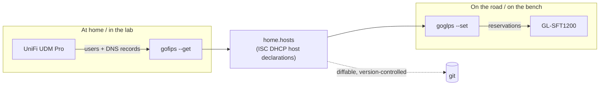
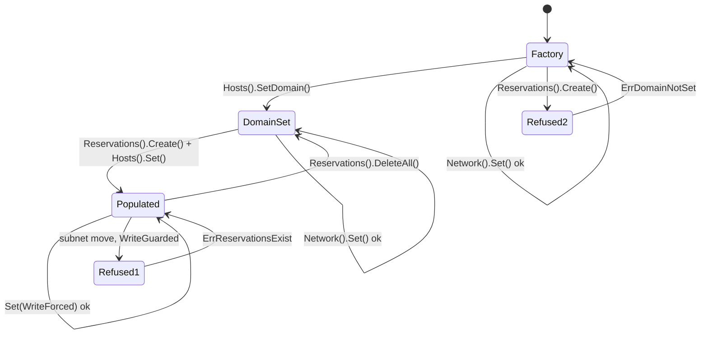
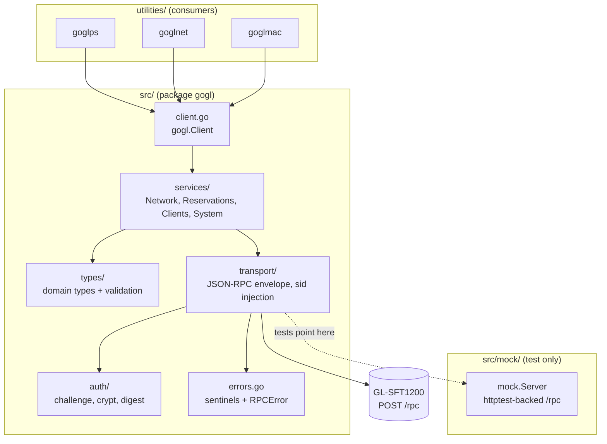
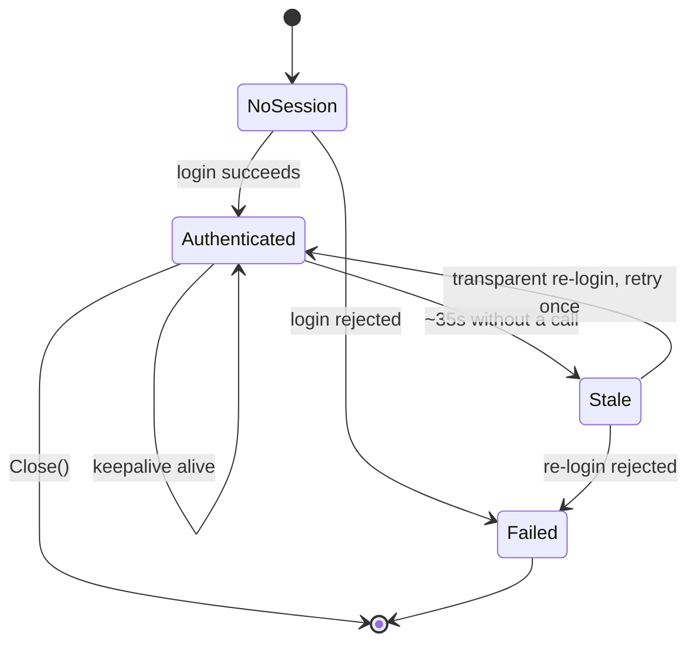
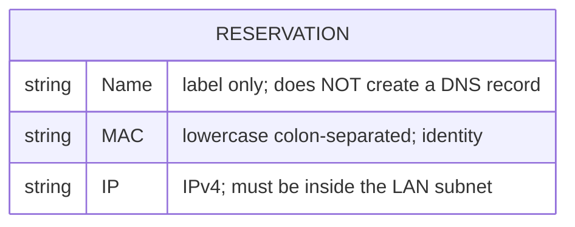
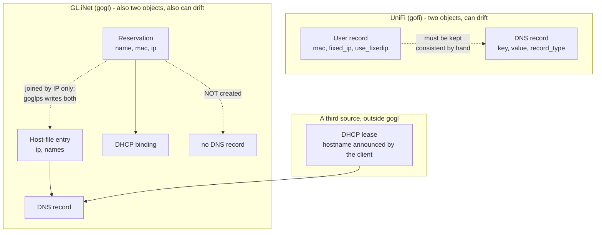

# gogl Design

Design for `gogl`, a Go module for programmatic control of GL.iNet travel routers running
firmware 4.x, targeting the GL-SFT1200 (Opal).

Requirements live in [`VISION.md`](../VISION.md). This document covers structure,
interfaces, and types. Where the two disagree, `VISION.md` wins.

**Status**: implemented. Every layer described here exists and is tested against the mock
server; `make all` is clean. Section [Phase 0: What Is Not Yet Known](#phase-0-what-is-not-yet-known)
remains open: the group and method names have not been captured from a live device, so the
constants are placeholders marked `PROVISIONAL` in the code. Nothing else depends on an
unverified API detail, by construction.

---

## The Problem

A network's addressing is the part devices depend on. A robot, a signage player, or a
build machine configured to reach `nas` at `192.168.4.13` stops working the moment it is
plugged into a network that does not agree. Reproducing that agreement by hand on a travel
router, one reservation at a time through a web UI, is slow and error-prone, and it has to
be redone every time the kit is reset.

`gofi` already exports a UniFi site's fixed-IP and DNS bindings as ISC DHCP host
declarations. `gogl` imports that same file into a GL.iNet travel router. The router then
hands out the same addresses to the same MAC addresses and answers the same names.



The file is the contract. It is plain text, so it diffs, reviews, and version-controls, and
a kit's network is reproducible from a commit rather than from memory.

---

## Scope Boundary

| Concern | Read | Write |
|---------|------|-------|
| Reservations (MAC to IP) | yes | **yes**, individually or cleared wholesale |
| DNS names (host file) | yes | **yes** |
| DNS domain (in gogl's host-file block) | yes | **yes** |
| DHCP pool alone | yes | **yes**, never guarded: nothing moves |
| LAN address or netmask | yes | **yes**, refused while reservations exist unless forced |
| DHCP leases | yes | no, the router owns these |
| Connected clients | yes | no |
| Model, firmware, uptime | yes | no |
| Lease time, upstream DNS servers | yes | no, no verified endpoint |
| dnsmasq `domain` / `expandhosts` | no | no, no endpoint and `/ubus` is 404 |
| Wireless identity (SSID, key, encryption, hidden, enabled) | yes | **yes**, only over a wired session |
| Radio tuning (channel, bandwidth, hw mode, power) | yes | **yes**, only over a wired session |
| VLANs, VPN, firewall | no | no |

The first version of this design made "reservations are the only thing gogl writes" a
structural rule, on the argument that it removed the transactional problem entirely. Two
findings on hardware made that untenable:

1. A static bind creates no DNS record. Names require a second write, to the host file, so
   there was already more than one writable surface.
2. Replicating a gofi network means matching its subnet. Requiring that be done by hand in the
   admin panel, in the middle of an otherwise scripted workflow, defeats the point of the tool.

So gogl now writes the network too, and the transactional problem is handled explicitly rather
than avoided.

### Ordering, not transactions

There is still no two-phase commit. Every write is an independent RPC, and a failure is
reported per-entry. What the hardware does impose is **ordering**, and both orderings are
enforced in the library so no consumer can skip them.



**A reservation write requires a domain.** `Create` and `Update` call `requireDomain` first and
return `types.ErrDomainNotSet`. A reservation with no name is an address nothing can find, and
nothing in the router's UI marks it as incomplete. Making the domain a precondition turns a
silent omission into an error at the point of the mistake. Reads and deletes are ungated:
only writes that create addressing are.

**A network write requires no reservations.** `Network().Set` lists reservations first and
returns `types.ErrReservationsExist`, including the count, because "clear them" is not
actionable without "how many".

The reason was wrong. This guard was written expecting the firmware to strand reservations
outside the new subnet. Observed 2026-07-29: it silently renumbers them, preserving host parts —
27 reservations moved from `192.168.2.x` to `192.168.8.x` with no prompt. The guard is kept
because an unannounced rewrite of every reservation is still a large side effect of an address
flag, and because the behavior is only known for a same-size subnet: a narrower netmask, or a
move that lands addresses inside the new pool, is untested. Twenty of those 27 landed in the
pool.

`Set` also validates before it writes, because the firmware will accept a pool outside its own
subnet and simply stop serving addresses, with no error to explain it.
`types.Network.ValidateForWrite` rejects a pool outside the subnet, a reversed range, an
unparseable address, and a missing interface name.

That check lives on the type rather than in the service for one reason: `goglnet --dry-run`
calls it too. A preview that approves what the real write would reject is worse than no
preview, so the two paths run identical code rather than similar code.

The remaining hazard is unavoidable: changing the LAN address moves the router out from under
the session issuing the call. `Set` treats a connection loss after the request as success,
since that is exactly what a successful renumber looks like from the client side.

## Package Structure



Directory layout, mirroring `gofi` so the two read side by side:

```
gogl/
├── src/                    # Library source (package gogl)
│   ├── client.go           # Client, Config, service accessors, Close
│   ├── errors.go           # Sentinel errors, RPCError
│   ├── types/
│   │   ├── network.go      # Network (LAN + DHCP, read-only)
│   │   ├── reservation.go  # Reservation + name/MAC/IP validation
│   │   ├── client.go       # Client (connected station)
│   │   ├── system.go       # SystemInfo
│   │   └── leasetime.go    # LeaseTime
│   ├── services/
│   │   ├── services.go     # Interface declarations
│   │   ├── network.go
│   │   ├── reservation.go
│   │   ├── client.go
│   │   └── system.go
│   ├── auth/
│   │   ├── crypt.go        # Unix crypt: MD5, SHA-256, SHA-512
│   │   └── login.go        # challenge/login sequence
│   ├── transport/
│   │   ├── transport.go    # Transport interface, Error
│   │   └── rpc.go          # JSON-RPC envelope, sid, keepalive, retry
│   ├── mock/
│   │   ├── server.go       # httptest /rpc server, challenge/login/alive
│   │   ├── handlers.go     # Per-group dispatch, fixtures, fault injection
│   │   └── fixtures/       # Verbatim captures from a live device (pending Phase 0)
│   └── ipmath/             # Subnet containment, uint32 sort, pool ranges
├── utilities/
│   ├── goglps/             # Reservations, ISC DHCP format (read/write)
│   ├── goglnet/            # LAN and DHCP report (read-only)
│   ├── goglmac/            # Clients + IEEE OUI lookup (read-only)
│   ├── internal/conn/      # Shared flag parsing and client construction
│   └── docs/               # Per-utility DESIGN.md
├── examples/
└── docs/
```

Import paths:

```go
import (
    gogl "github.com/emergingrobotics/gogl/src"
    "github.com/emergingrobotics/gogl/src/types"
)
```

The module is `github.com/emergingrobotics/gogl` and the library sits under `src/`, so the
root package is imported as `.../gogl/src` while its package name is `gogl`. This is
`gofi`'s arrangement, kept for consistency.

---

## Authentication

The most intricate part of the module, and the part most likely to be got wrong. Two
independent expiry windows overlap, and a naive implementation fails intermittently rather
than consistently.

### The Two-Challenge Sequence

The router's `challenge` returns a salt and a nonce. Deriving the password cipher requires
5000 rounds of SHA-512, which takes long enough that the nonce from the *same* challenge
may already be dead by the time the cipher is ready. So the sequence issues `challenge`
twice: once to learn the salt, once more to get a nonce that is fresh at the moment of use.

```mermaid
sequenceDiagram
    autonumber
    participant S as services
    participant T as transport
    participant A as auth
    participant R as Router /rpc

    S->>T: Call(ctx, group, method, args)
    T->>A: Login(ctx)

    A->>R: {"method":"challenge","params":{"username":"root"}}
    R-->>A: {"alg":5,"salt":SALT,"nonce":NONCE_0,"hash-method":"sha256"}

    Note over A: cipher = crypt(password, "$5$SALT")<br/>5000 rounds — SLOW<br/>NONCE_0 is likely dead now; discarded

    A->>R: {"method":"challenge","params":{"username":"root"}}
    R-->>A: {"alg":5,"salt":SALT,"nonce":NONCE_1,"hash-method":"sha256"}

    Note over A: hash = H("root:" + cipher + ":" + NONCE_1)<br/>H per hash-method: sha256 on 4.3.28, md5 if absent<br/>FAST — well inside the nonce window

    A->>R: {"method":"login","params":{"username":"root","hash":HASH}}
    R-->>A: {"sid":SID}

    A-->>T: sid
    T->>R: {"method":"call","params":[SID,group,method,args]}
    R-->>T: {"result":{...}}
    T-->>S: decoded result
```

`cipher` depends only on password and salt, so it is cached for the client's lifetime and
the expensive step happens once. `nonce` and `hash` are never cached.

### Session Lifetime

The `sid` expires after roughly 35 seconds of inactivity, and any successful call resets
the timer.



Two mechanisms cover expiry, and both are needed:

- A **keepalive goroutine** issues `alive` every 20 seconds, keeping long-lived clients
  authenticated. It is the normal path.
- **Transparent retry** handles the race the keepalive cannot: a session that expires
  between the keepalive tick and a call. On an access-denied error the transport re-logs in
  and retries the call exactly once. A second failure surfaces to the caller.

Retry is bounded at one attempt deliberately. An unbounded retry loop against a wrong
password becomes a login flood on a small SoC.

### Concurrency

```go
// session holds the authenticated state shared by all in-flight calls.
type session struct {
    sid    atomic.Value  // string; read without locking on the hot path
    cipher atomic.Value  // string; derived once, reused for every re-login

    // loginMu serializes re-authentication. A burst of calls that all see an
    // expired sid must produce one login, not one per call.
    loginMu sync.Mutex

    sem chan struct{} // request semaphore; the SFT1200 drops requests under load
}
```

The pattern is double-checked locking: a caller that finds the sid stale takes `loginMu`,
re-reads the sid, and only logs in if another goroutine has not already done so. This is
the same shape as `gofi`'s CSRF token handling, for the same reason.

---

## Transport

One interface, so that every consumer above it is testable against the mock without
touching HTTP.

```go
package transport

// Transport performs authenticated JSON-RPC calls against a GL.iNet router.
// Implementations handle session acquisition, renewal, and single-retry on expiry.
type Transport interface {
    // Call invokes method on group with args, decoding the result into out.
    // out may be nil to discard the result. args may be nil for no arguments.
    Call(ctx context.Context, group, method string, args, out any) error

    // Close stops the keepalive goroutine and releases resources.
    Close() error
}
```

### Wire Format

Every authenticated operation is the `call` method. The group and method are data, not
part of the URL, which is why a single generic `Call` covers the whole API.

Request:

```json
{
  "jsonrpc": "2.0",
  "id": 3,
  "method": "call",
  "params": ["<sid>", "<group>", "<method>", { "...": "args" }]
}
```

Success:

```json
{ "jsonrpc": "2.0", "id": 3, "result": { "...": "payload" } }
```

Failure:

```json
{ "jsonrpc": "2.0", "id": 3, "error": { "code": -32000, "message": "Access denied" } }
```

`id` is a per-client monotonic counter. Responses are matched to requests by `id`, and a
mismatched `id` is a protocol error rather than something to tolerate, since the transport
issues one request per HTTP round trip and has no multiplexing to reconcile.

### The Generic Escape Hatch

`Client.Call` exposes the transport's `Call` directly:

```go
// Call invokes an arbitrary group/method on the router, bypassing the typed
// services. It exists so that endpoints not yet modelled remain reachable, and
// because API discovery is done with it. Prefer a typed service where one exists.
func (c *Client) Call(ctx context.Context, group, method string, args, out any) error
```

This stays public after Phase 0. It is how the fixtures get captured, and it means an
endpoint nobody has modelled yet never blocks a consumer.

---

## Types

### Reservation

The central type. GL.iNet calls it a "static bind".



**An earlier version of this document claimed a reservation was simultaneously the DHCP
binding and the DNS record.** That was tested against a GL-SFT1200 on firmware 4.3.28 and is
false. The corrected model:



The evidence, since this contradicts both the admin panel's labelling and the obvious reading
of the API:

1. A bind for an absent MAC never resolved, bare or `.lan`-suffixed.
2. A bind for a **present, actively leased** device under a *new* name still did not resolve,
   while that device's original lease hostname kept resolving throughout.
3. Writing the same name into the host file via `dns.set_host` resolved immediately, for both
   the bare name and an arbitrary FQDN.

Design consequences:

- gogl reproduces addresses **and** names, but through two different endpoints. `goglps` writes
  both from one host declaration, so this is invisible in normal use.
- `Name` on a `Reservation` is a label: it identifies the entry in the admin panel and keys it
  in an exported ISC DHCP host file. Neither is DNS. The DNS record is a `HostEntry`.
- **Drift is possible**, and it is the same class of problem `gofi` has with UniFi's separate
  user and DNS records. gogl treats it as repairable rather than exceptional: the two diffs in
  `goglps --set` run independently, so a binding whose name went missing gets its name back on
  the next run. See [Reconciliation](#reconciliation).
- Names sometimes resolve without gogl's involvement, because most clients announce a sensible
  DHCP hostname. That is the client's doing, outside gogl's control, and not something to rely
  on: it disappears when the lease does.

```go
package types

// Reservation is a static DHCP binding -- what GL.iNet calls a "static bind".
//
// A reservation pins a MAC address to an IP address. It does NOT create a DNS
// record: a bind's Name is a label. DNS records come from HostFile, written
// through HostsService. The router also answers from DHCP lease hostnames that
// clients supply themselves, which is why a name sometimes resolves with no help
// from gogl; that disappears with the lease.
type Reservation struct {
    // Name labels the entry. It is NOT a DNS name.
    Name string `json:"name"`

    // MAC is the client identity, lowercase colon-separated. It is the key for
    // update and delete: the only thing a client cannot change about itself.
    MAC string `json:"mac"`

    // IP is the reserved IPv4 address.
    IP string `json:"ip"`
}

// Validate reports whether r is fit to write, normalizing MAC in place.
func (r *Reservation) Validate() error
```

There is no `Enabled` field: `lan.get_static_bind_list` returns exactly these three, and a
binding either exists or it does not.

#### Name Validation

Two reasons, and neither is that the router will serve it as DNS — it will not. GL.iNet
writes the name into its dnsmasq config file, and a known firmware defect lets a character
such as `"` corrupt that file, breaking DHCP for the whole router until it is repaired by
hand. And the ISC DHCP host format this project exchanges is keyed by hostname, so a name
that is not a legal DNS label cannot round-trip.

Validation rejects rather than escapes:

| Rule | Reason |
|------|--------|
| Characters limited to `[a-zA-Z0-9-]`, plus `.` as a label separator | Anything else risks the config file, and is not a legal DNS label |
| Must not start or end with `-` or `.` | Not a legal DNS label |
| Each label ≤ 63 chars, total ≤ 253 | DNS limits |
| Must not be empty | A nameless reservation is not writable through this path |

This is **stricter than `gofips`**, which permits `_`. A UniFi record named `my_server`
is rejected, with the offending character named, rather than silently rewritten to
`my-server`. Renaming a host is the operator's decision.

Validation lives on the type, not in the CLI, so the library cannot be used to write a
name that would damage the device.

### Network

Read and written. `goglnet` reports it; `goglnet --set-*` changes it, under the ordering rule in
[Scope Boundary](#scope-boundary).

```go
// Network is one interface's address and DHCP configuration, as returned by
// lan.get_config_list.
//
// Read to report state and to validate that reservations fall inside the subnet.
// Written by NetworkService.Set, which is refused while reservations exist and
// which drops the calling session, since the router moves.
//
// Field names mirror the firmware verbatim. Note there is no domain field: no
// endpoint exposes the dnsmasq suffix, so gogl keeps its own in the host file.
type Network struct {
	// Interface is "lan" or "guest".
	Interface string `json:"interface"`

	LANIP   string `json:"ip"`
	Netmask string `json:"netmask"`

	DHCPEnabled IntBool   `json:"enable"`
	DHCPStart   string    `json:"start"`
	DHCPStop    string    `json:"end"`
	DHCPLease   LeaseTime `json:"leasetime"`

	// Gateway is advertised to clients when non-empty.
	Gateway string `json:"gateway,omitempty"`

	DNS []string `json:"dns,omitempty"`
}

// IntBool is a bool the firmware sends as 0 or 1 rather than as a JSON boolean.
// Only used where a fixture proved the need; see the decision on FlexInt/FlexBool.
type IntBool bool

// Subnet returns the LAN as a CIDR network, derived from LANIP and Netmask.
func (n *Network) Subnet() (*net.IPNet, error)

// Contains reports whether ip falls inside the LAN subnet.
func (n *Network) Contains(ip net.IP) (bool, error)

// IsGuest reports whether this is the guest interface. gogl only ever writes the
// main LAN.
func (n *Network) IsGuest() bool

// ValidateForWrite checks that n describes a network the firmware can serve. On
// the type rather than in the service so that goglnet --dry-run runs the identical
// check: a preview that approves what the write would reject is worse than none.
func (n *Network) ValidateForWrite() error

// InDHCPPool reports whether ip falls inside the dynamic pool. Informational
// only: dnsmasq honors a static lease inside the dynamic range and excludes
// that address from dynamic allocation, so this is a tidiness warning and never
// an error. (It would be a genuine conflict under ISC dhcpd, which is where the
// contrary intuition comes from.)
func (n *Network) InDHCPPool(ip net.IP) (bool, error)
```

The field tags are the firmware's, not a naming choice. An earlier draft of this document
guessed `lan_ip`, `dhcp_enabled` and a `domain` field; the device sends `ip`, `enable` and no
domain at all.

### HostFile

Where DNS records actually live, and the reason this type exists at all.

```go
// HostEntry is one line of the managed block: an address and the names it answers.
type HostEntry struct {
	IP    string
	Names []string
}

// HostFile is a parsed host file, split into the parts gogl owns and the parts it
// must preserve.
type HostFile struct {
	// Before and After are the unmanaged content surrounding gogl's block,
	// preserved verbatim.
	Before string
	After  string

	// Domain is the suffix gogl appends when generating FQDNs. Empty means it has
	// never been configured, which several operations refuse to proceed without.
	Domain string

	// Entries are the managed lines.
	Entries []HostEntry
}

// ParseHostFile splits raw content around gogl's block. A file with no block
// parses as all-unmanaged with no domain, which is the factory state and is how
// "domain not configured" is detected.
func ParseHostFile(raw string) *HostFile

// Render rebuilds the whole file: unmanaged parts verbatim, block regenerated.
func (f *HostFile) Render() string

// FQDN returns the qualified form of name, or name unchanged if it already
// contains a dot or no domain is set.
func (f *HostFile) FQDN(name string) string

// Set adds or replaces the entry for name, which carries both the bare and
// qualified spellings so either resolves.
func (f *HostFile) Set(name, ip string) error

// Remove drops every entry answering name, in either spelling, and reports
// whether anything went. Matching only the spelling given would strip half an
// entry: removing "nas.lab.example" would leave a bare "nas" still answering.
func (f *HostFile) Remove(name string) bool

// Lookup returns the address for name, in either spelling.
func (f *HostFile) Lookup(name string) (string, bool)

// Clear removes every managed entry, leaving the block and its domain.
func (f *HostFile) Clear()
```

`Before` and `After` are the unmanaged content, preserved byte for byte: `dns.set_host` replaces
the whole file, and it holds the loopback and IPv6 lines the router resolves its own name from.

`Domain` rides in the begin-marker line. That is not a stylistic choice -- no endpoint sets
dnsmasq's domain and `/ubus` is 404 on this model, so gogl writes fully-qualified names and needs
the suffix stored where it travels with the device.

### LeaseTime

The one genuine format conversion in the module. UniFi expresses lease time as an integer
count of seconds; dnsmasq expresses it as a duration string.

```go
// LeaseTime is a DHCP lease duration. It unmarshals from a dnsmasq duration
// string ("12h", "1d", "infinite") or a bare number of seconds, and marshals to
// the dnsmasq duration form. This bridges UniFi's dhcpd_leasetime, which is
// always an integer of seconds, and dnsmasq's string form.
type LeaseTime time.Duration

// LeaseInfinite is the sentinel for dnsmasq's "infinite", which has no
// meaningful time.Duration and must not be represented as an overflow.
const LeaseInfinite = LeaseTime(math.MaxInt64)

func (l *LeaseTime) UnmarshalJSON(b []byte) error
func (l LeaseTime) MarshalJSON() ([]byte, error)
func (l LeaseTime) String() string
```

### Client and SystemInfo

```go
// Client is a station currently known to the router. Field presence varies with
// firmware, so optional fields are pointers or zero-checked; nothing is
// invented to match gofi's richer UniFi client record.
type Client struct {
    MAC      string `json:"mac"`
    IP       string `json:"ip,omitempty"`
    Name     string `json:"name,omitempty"`
    Online   bool   `json:"online"`
    IsWired  bool   `json:"is_wired"`
    RXBytes  uint64 `json:"rx_bytes,omitempty"`
    TXBytes  uint64 `json:"tx_bytes,omitempty"`
    Signal   *int   `json:"signal,omitempty"`
    Band     string `json:"band,omitempty"`
}

// SystemInfo identifies the device.
type SystemInfo struct {
    Model    string `json:"model"`
    Firmware string `json:"firmware"`
    MAC      string `json:"mac,omitempty"`
    Uptime   int64  `json:"uptime,omitempty"`
}
```

`gofi`'s `FlexInt` and `FlexBool` are deliberately **not** ported. UniFi's JSON is
inconsistent about types; GL.iNet's is not. They get added only if a recorded fixture
proves a field needs them, and the `alg` field in the challenge response is the one known
case so far — handled locally in `auth`, not by a general-purpose flex type.

---

## Service Interfaces

Small interfaces, one per concern, each independently mockable. No `site` parameter
anywhere: GL.iNet routers have no equivalent of a UniFi site.

```go
package services

// NetworkService reads the router's LAN and DHCP configuration. Read-only.
type NetworkService interface {
	// Get returns the main LAN interface.
	Get(ctx context.Context) (*types.Network, error)

	// List returns every interface the router reports, main LAN and guest alike.
	List(ctx context.Context) ([]types.Network, error)

	// Leases returns the dynamic DHCP leases currently held. These are not
	// reservations: a lease expires, a reservation is a permanent MAC-to-IP
	// binding. Leases are how you discover what is worth reserving.
	Leases(ctx context.Context) ([]types.DHCPLease, error)

	// Set writes an interface's address and DHCP pool.
	//
	// A change that moves the subnet is refused with ErrReservationsExist while any
	// reservation is present, unless mode is WriteForced. The firmware silently
	// renumbers every bind into the new subnet rather than stranding them, which is
	// not what that guard was designed against; see the correction on
	// networkService.Set.
	//
	// A pool-only change is never guarded and never drops the session: the router
	// keeps its address, so no reservation moves.
	//
	// Moving the subnet changes the address the router is managed at, so the calling
	// session will not survive that case.
	Set(ctx context.Context, n *types.Network, mode WriteMode) error
}

// HostsService manages DNS names through the router's hosts file.
//
// This is the only way gogl creates DNS records. A reservation does not: on this
// firmware its name is a label. gogl owns a delimited block in the file and
// preserves everything outside it.
type HostsService interface {
	// Get returns the parsed host file, managed and unmanaged parts alike.
	Get(ctx context.Context) (*types.HostFile, error)

	// Put writes the host file back.
	Put(ctx context.Context, f *types.HostFile) error

	// Domain returns the configured DNS domain, empty if never set.
	Domain(ctx context.Context) (string, error)

	// SetDomain configures the domain and requalifies existing entries.
	SetDomain(ctx context.Context, domain string) error

	// List returns the managed entries.
	List(ctx context.Context) ([]types.HostEntry, error)

	// Set points name at ip. Requires a configured domain.
	Set(ctx context.Context, name, ip string) error

	// Remove drops the entry for name.
	Remove(ctx context.Context, name string) error

	// Clear removes every managed entry.
	Clear(ctx context.Context) error
}

// ReservationService manages static DHCP bindings.
//
// A binding pins a MAC to an IP. It does not create a DNS record -- see
// types.Reservation, and HostsService for names.
type ReservationService interface {
	List(ctx context.Context) ([]types.Reservation, error)

	// GetByMAC returns the reservation for mac, or ErrNotFound.
	GetByMAC(ctx context.Context, mac string) (*types.Reservation, error)

	// GetByIP returns every reservation holding ip. More than one indicates
	// inconsistent device state rather than normal operation, so the caller
	// decides whether to tolerate it.
	GetByIP(ctx context.Context, ip string) ([]types.Reservation, error)

	// GetByName returns the reservation named name, or ErrNotFound.
	GetByName(ctx context.Context, name string) (*types.Reservation, error)

	// Create writes a new reservation. Returns ErrConflict if the MAC is already
	// reserved, and ErrDomainNotSet if no DNS domain has been configured.
	// Validates before touching the device.
	Create(ctx context.Context, r *types.Reservation) (*types.Reservation, error)

	// Update replaces the reservation identified by r.MAC.
	Update(ctx context.Context, r *types.Reservation) (*types.Reservation, error)

	// Delete removes the reservation for mac.
	Delete(ctx context.Context, mac string) error

	// DeleteAll removes every reservation in one call.
	//
	// Deliberately explicit rather than a mode flag on Delete: this is the one
	// operation that can discard a whole network's addressing, and it should be
	// impossible to reach by passing the wrong argument.
	DeleteAll(ctx context.Context) error
}

// WirelessService reads and writes wireless identity: SSID, passphrase, hidden and
// enabled state, per interface.
//
// Writes are refused when the calling session arrives over WiFi, because applying
// one would sever that session with no address to reconnect at. See
// VISION.md's Wireless Writes section.
type WirelessService interface {
	// Radios returns every radio with its interfaces.
	Radios(ctx context.Context) ([]types.WirelessRadio, error)

	// Interfaces returns every wireless interface, flattened across radios.
	Interfaces(ctx context.Context) ([]types.WirelessInterface, error)

	// Get returns the interface named name, or ErrNotFound listing the valid names.
	Get(ctx context.Context, name string) (*types.WirelessInterface, error)

	// Radio returns the radio named device, or ErrNotFound listing the valid names.
	Radio(ctx context.Context, device string) (*types.WirelessRadio, error)

	// SetSSID writes one interface's SSID. A convenience wrapper over SetInterface.
	SetSSID(ctx context.Context, name, ssid string) error

	// SetInterface writes a partial update to one interface: SSID, passphrase,
	// encryption, hidden or enabled. Unset fields are left alone.
	SetInterface(ctx context.Context, name string, changes types.InterfaceChanges) error

	// SetRadio writes a partial update to one radio's tuning: channel, bandwidth,
	// hardware mode or transmit power. Every interface on the radio inherits it.
	SetRadio(ctx context.Context, device string, changes types.RadioChanges) error

	// SessionInterface reports the firmware's name for the link this session
	// arrives over: "cable", "2.4G", "5G", or "" when off-LAN.
	SessionInterface(ctx context.Context) (string, error)
}

// ClientService reads stations known to the router. Read-only.
type ClientService interface {
	List(ctx context.Context) ([]types.Client, error)
}

// SystemService reads device identity. Read-only.
type SystemService interface {
	Info(ctx context.Context) (*types.SystemInfo, error)
}
```

MAC is the identity for `Update` and `Delete`. It is the only field a client cannot change
about itself, and it is what dnsmasq keys the bind on. Names are keyed separately, by name, in
`HostsService`: the two tables are joined by IP address and nothing else, which is why
`goglps` reports drift between them rather than assuming they agree.

### Client Construction

```go
package gogl

// Config configures a Client. Zero values are safe: the resulting client
// verifies TLS and uses conservative timeouts.
type Config struct {
    Host string // required
    Port int    // default 80
    HTTPS bool  // default false; GL.iNet serves HTTP on 80

    Username string // default "root"
    Password string // required

    // InsecureSkipVerify disables TLS certificate verification. Named for what
    // it does, and false by default, so the library is secure by default even
    // though the CLIs default the other way for self-signed certs. A library
    // must not be insecure at its zero value.
    InsecureSkipVerify bool

    Timeout           time.Duration // default 10s
    KeepaliveInterval time.Duration // default 20s, must stay under the ~35s expiry
    MaxConcurrent     int           // default 4
}

type Client struct { /* ... */ }

func New(cfg Config) (*Client, error)

func (c *Client) Network() services.NetworkService
func (c *Client) Reservations() services.ReservationService
func (c *Client) Clients() services.ClientService
func (c *Client) System() services.SystemService

func (c *Client) Call(ctx context.Context, group, method string, args, out any) error
func (c *Client) Close() error
```

`New` does not contact the router. The first call authenticates lazily, so constructing a
client is cheap and cannot fail on a network error.

Note the deliberate inversion: `Config.InsecureSkipVerify` defaults to secure, while the
CLIs default to accepting self-signed certificates and require `-k` to enforce. A library
whose zero value is insecure is a hazard; a CLI that cannot talk to the device out of the
box is useless. The CLIs set the field explicitly, and `VISION.md` documents the flag.

---

## Error Model

```go
package gogl

var (
    // ErrUnauthorized means the router rejected the credentials.
    ErrUnauthorized = errors.New("gogl: unauthorized")

    // ErrSessionExpired means the sid was stale. Normally handled internally by
    // one transparent re-login; surfaced only when that re-login also fails.
    ErrSessionExpired = errors.New("gogl: session expired")

    // ErrNonceExpired means the login nonce died before it was used. Retriable.
    ErrNonceExpired = errors.New("gogl: challenge nonce expired")

    // ErrUnsupportedAlgorithm means the challenge named a crypt algorithm we do
    // not implement. Never falls back to a weaker one.
    ErrUnsupportedAlgorithm = errors.New("gogl: unsupported crypt algorithm")

    ErrNotFound = errors.New("gogl: not found")
    ErrConflict = errors.New("gogl: conflict")

    // ErrInvalidName means a reservation name failed validation. Returned
    // rather than escaped, because a bad name can corrupt dnsmasq's config.
    ErrInvalidName = errors.New("gogl: invalid reservation name")

    // ErrOutsideSubnet means an address does not fall inside the router's LAN.
    ErrOutsideSubnet = errors.New("gogl: address outside LAN subnet")
)

// RPCError is a JSON-RPC error returned by the router, carrying the group and
// method that produced it so that a failure is traceable to a call site.
type RPCError struct {
    Code    int
    Message string
    Group   string
    Method  string
}

func (e *RPCError) Error() string
func (e *RPCError) Unwrap() error // maps known codes onto the sentinels above
```

`RPCError.Unwrap` is what lets callers write `errors.Is(err, gogl.ErrNotFound)` without
knowing the router's numeric codes. The code-to-sentinel table is populated from recorded
fixtures during Phase 0, not guessed.

---

## Data Flow: `goglps --set`

The primary write path. It touches two tables, because a host declaration is two facts the
firmware stores separately and joins for nobody.

```mermaid
sequenceDiagram
    autonumber
    participant U as operator
    participant PS as goglps
    participant P as parse.go
    participant C as gogl.Client
    participant R as Router

    U->>PS: goglps -H ROUTER_IP --set home.hosts

    Note over PS,P: Phase 1 - offline. No device contact.
    PS->>P: parse(home.hosts)
    P-->>PS: []Reservation
    PS->>PS: validate names, MACs, IPs
    PS->>PS: reject duplicate name / MAC / IP
    alt any validation error
        PS-->>U: all errors with line numbers, exit 1
    end

    Note over PS,R: Phase 2 - read device state, once.
    PS->>C: Network().Get()
    C->>R: lan.get_config_list
    R-->>C: Network
    PS->>C: Reservations().List()
    C->>R: lan.get_static_bind_list
    R-->>C: []Reservation
    PS->>C: Hosts().Get()
    C->>R: dns.get_host
    R-->>C: HostFile
    alt no DNS domain configured
        PS-->>U: ErrDomainNotSet, with the remedy, exit 1
    end

    Note over PS: Phase 3 - reconcile. Two diffs, not one.
    alt any IP outside LAN subnet
        PS-->>U: subnet mismatch, both remedies, exit 1
    end
    PS->>PS: warn on IPs inside the DHCP pool (never fatal)
    PS->>PS: planChanges: bindings -> create / update / skip / prune
    PS->>PS: planNames: names -> set / remove

    Note over PS,R: Phase 4 - write. Bindings per entry, names in one call.
    loop each create or update
        PS->>C: Reservations().Create / Update
        C->>R: lan.add_static_bind / set_static_bind
        R-->>C: ok or error
        Note over PS: per-entry failure is logged; the loop continues
    end
    PS->>PS: apply every name change to the in-memory host file
    PS->>C: Hosts().Put()
    C->>R: dns.set_host (whole file, once)
    R-->>C: ok

    PS-->>U: summary; exit 1 if any entry failed
```

The four phases matter. All input validation completes before any device contact, so a
malformed file never results in a half-written router. All device reads complete before any
write, so both diffs are computed against one consistent snapshot. Binding writes are
independent, so one failure does not abort the rest.

The names are batched into a single `Put` for a reason specific to this API: `dns.set_host`
takes the entire file as one string. Writing per name would be one read-modify-write cycle per
entry, each racing the last, and a run interrupted halfway would leave a file assembled from
two different snapshots. One write of a fully-computed file cannot do that.

The two tables can disagree, and gogl treats that as a repairable state rather than an error.
A binding whose name is missing from the host file is not skipped just because the binding
matches: `planNames` diffs independently, so the next `--set` writes the missing name. The
reverse case, a name with no binding, is reported and removed by `--prune`.

### Reconciliation

Two diffs, keyed differently, because the two tables are keyed differently.

**Bindings, keyed by MAC** — the only thing a client cannot change about itself:

| In file | On device | Same IP + name | Action |
|---------|-----------|----------------|--------|
| yes | no | — | **create** |
| yes | yes | yes | **skip** |
| yes | yes | no | **update** |
| no | yes | — | **prune** with `--prune`, otherwise leave and count |

**Names, keyed by name** — the host file has no MAC column, so it joins to a binding by
address and nothing else:

| In file | In host file | Same IP | Action |
|---------|--------------|---------|--------|
| yes | no | — | **set** |
| yes | yes | yes | nothing |
| yes | yes | no | **set**, replacing the old address |
| no (pruned) | yes | — | **remove** with `--prune`, otherwise leave and count |

Idempotence falls out of both: running `--set` twice makes changes the first time and reports
all skips the second, and the second run leaves the host file byte-identical. That property is
what makes the file usable as a checked-in description of a network.

Because the diffs are independent, `--set` also repairs drift between the tables. A binding
whose name was deleted from the host file is still "skip" on the binding side and "set" on the
name side, so the name comes back. This is why the name diff is not folded into the MAC-keyed
table: doing so would make a matching binding suppress a missing name.

---

## Mock Server

Tests run against the mock, never hardware. Rule 5 in `VISION.md` — no SSH, no UCI, no
shell — exists so that the entire surface stays reachable this way.

```go
package mock

// Server is an httptest-backed JSON-RPC endpoint that behaves like a GL.iNet
// router, including its authentication quirks.
type Server struct { /* ... */ }

type Options struct {
    Username string
    Password string

    // Alg selects the crypt algorithm advertised by challenge, so that tests
    // exercise MD5, SHA-256 and SHA-512 paths.
    Alg int

    // AlgAsString makes challenge emit alg as a JSON string rather than a
    // number, reproducing observed firmware variation.
    AlgAsString bool

    // NonceTTL and SessionTTL default to the device's real windows. Tests
    // shorten them to drive expiry deterministically.
    NonceTTL   time.Duration
    SessionTTL time.Duration
}

func NewServer(t *testing.T, opts Options) *Server
func (s *Server) URL() string
func (s *Server) LoadFixture(name string) error

// Reservations exposes the mock's state so tests can assert on writes rather
// than only on returned values.
func (s *Server) Reservations() []types.Reservation

// FailNext makes the next call to group/method return an RPC error, for
// exercising per-entry failure handling.
func (s *Server) FailNext(group, method string, code int, message string)
```

The mock must enforce the real protocol's hostile behaviors, not just serve happy-path
payloads:

| Behavior | Why the mock must have it |
|----------|---------------------------|
| Real challenge/response with configurable `alg` | The crypt implementation is the likeliest source of a subtle bug, and it needs all three algorithms exercised |
| Nonce expiry | A client that caches a challenge must fail in tests, exactly as it would against hardware |
| Session expiry | Proves the keepalive and the single transparent retry both work |
| `alg` as number *and* string | Observed firmware variation |
| JSON-RPC error objects | Proves `RPCError.Unwrap` maps onto sentinels |
| Injected per-call failure | Proves `--set` continues past one bad entry and still exits 1 |

Fixtures are captured verbatim from a live SFT1200 and committed. A test that needs a
payload shape nobody has observed is a signal to go capture it, not to invent it.

---

## Testing Strategy

Every function has a test; no phase advances below 100% coverage. Beyond that:

| Layer | Approach |
|-------|----------|
| `auth/crypt.go` | Table tests against known `openssl passwd` outputs for all three algorithms. Pure function, no I/O. |
| `auth/login.go` | Against the mock, including nonce expiry and unsupported `alg`. |
| `transport` | Session expiry mid-call, exactly-one-retry, `id` mismatch, semaphore limit, keepalive cancellation on `Close`. |
| `types` | Validation tables, especially name rejection. `LeaseTime` round-trips both input forms. |
| `services` | Against the mock with fixtures; assert on the mock's resulting state, not only returned values. |
| `ipmath` | Property tests: subnet containment, pool boundaries, uint32 ordering. |
| `utilities/*/parse.go` | Round-trip: parse → format → parse is stable. Real `gofips --get` output as a fixture. |
| Concurrency | `-race` on every run. A test that fires N concurrent calls at an expired session and asserts exactly one login occurred. |

The concurrency test is the one worth writing first and keeping. Double-checked locking
around re-authentication is easy to write subtly wrong and the failure only appears under
load, which is exactly where a small SoC punishes it.

### Interoperability

One test that is not a unit test and matters more than any of them: a committed
`gofips --get` output file, parsed by `goglps`, asserted to yield the expected
reservations. That is the interoperability contract between the two modules, and it is the
only thing that would catch `gofi` changing its output format.

---

## What Discovery Found

GL.iNet's official 4.x API reference is no longer publicly reachable, so every group and
method name here was captured from a live SFT1200 with `Client.Call` before any typed service
was written. Discovery is complete; this section records the answers, because several of them
contradict what the design assumed.

The full surface is in [`../GL_INET_4X_API_DOCUMENTATION.md`](../GL_INET_4X_API_DOCUMENTATION.md)
and [`api/`](api/README.md) (43 groups, 313 methods, each marked verified / absent / untested).

| Question | Answer |
|----------|--------|
| LAN + DHCP config | `lan.get_config_list`, returning both `lan` and `guest` in one call. Written with `lan.set_config`. Not `dhcp.*`, which does not exist. |
| Reservation list / add / update / delete | `lan.get_static_bind_list`, `add_static_bind`, `set_static_bind`, `remove_static_bind` |
| Is update distinct from add? | Distinct. `add_static_bind` on an existing MAC is a conflict, so `Create` can detect one and `Update` is a real update. |
| Is there a bulk replace? | No. Writes are per-entry, which also makes failures per-entry and reportable. `remove_static_bind` takes a mode argument where `1` clears the whole table. |
| Connected clients | `client.get_list` |
| Which client fields exist | `iface` as `"cable"` / `"2.4G"` / `"5G"`, plus `total_rx` / `total_tx`. No `signal` field, and no separate wired flag: the band is inferred from `iface`. |
| Model and firmware | `system.get_status`. **It also returns WiFi passphrases in cleartext**, so `SystemService` reads only what it needs and gogl never logs the raw payload. |
| Error codes | `-32000` access denied, `-32001` not found, `-32003` rate limited with `data.wait`, `-32601` method not found, `-32602` method exists but needs arguments, `-32603` internal |
| Do writes need an apply/commit? | **No.** Static binds and host-file writes take effect immediately. This was the one open item that could have changed the design; it did not. `--set` needs no final apply call and there is no partially-staged state. |
| DHCP leases | `network.get_dhcp_leases`. The array is `leases`, not `entries` as the vendored description claims. |

Three findings the design did not anticipate:

**A static bind does not create a DNS record.** Its name is a label. Verified by writing a bind
and failing to resolve the name against the router. This was the project's central premise, and
it was wrong. DNS records come from `dns.get_host` / `dns.set_host`, which read and write the
`hosts(5)` file dnsmasq answers from — confirmed working for a bare name and for an arbitrary
FQDN.

**There is no way to set dnsmasq's domain.** No endpoint exposes `domain`, `local`, or
`expandhosts`, and `POST /ubus` — the standard OpenWrt route to UCI, which would have — returns
404, because nginx fronts the admin interface on this model rather than uhttpd. gogl writes
fully-qualified names into the host file instead, which works for any suffix, and keeps the
suffix in its own marker line.

**`set_host` replaces the entire file.** Including the loopback and IPv6 boilerplate the router
resolves its own name from. `types.HostFile` therefore parses the file into managed and
unmanaged parts and preserves the latter verbatim. An early manual test truncated that
boilerplate and left `ff02::2 ip6-allrouters` answering for a hostname; the byte-exact
preservation is now pinned by a test.

---

## Design Decisions

Dated for future readers wondering why.

| Date | Decision | Reasoning |
|------|----------|-----------|
| 2026-07-27 | ~~Reservations are the only thing `gogl` writes~~ **superseded 2026-07-28** | Mirrored `gofi`'s read/write posture per tool and removed transactional complexity. Two hardware findings killed it: a static bind creates no DNS record, so names needed a second writable surface; and requiring a hand-edited subnet mid-workflow defeated the tool. Replaced by the ordering guards. |
| 2026-07-27 | Three utilities only: `goglps`, `goglmac`, `goglnet` | One-for-one with `gofi`'s `gofips`, `gofimac`, `gofinet`. Scope beyond the mirror is not v1. |
| 2026-07-27 | ISC DHCP host declarations are the interchange format; no new format | `gofips --get` already emits exactly name + MAC + IP. A new JSON profile would carry no additional information for this scope. |
| 2026-07-27 | ~~JSON-RPC only; no SSH, no UCI, no shell~~ **amended 2026-07-28** | The mock-reachability argument applies to any HTTP API, not to JSON-RPC specifically, so UCI over `POST /ubus` would have been admissible. Moot regardless: `/ubus` is 404 on this device, since nginx fronts the admin interface rather than uhttpd. SSH and shell stay excluded, being unmockable. |
| 2026-07-27 | Two `challenge` calls per login | The nonce lives ~1s while the SHA-512 crypt is deliberately slow. One challenge is a race that fails intermittently. |
| 2026-07-27 | Transparent re-login retries exactly once | Covers the keepalive race without turning a bad password into a login flood. |
| 2026-07-27 | `Config.InsecureSkipVerify` defaults secure; CLIs default insecure | A library must not be insecure at its zero value. A CLI that cannot reach a self-signed device out of the box is useless. |
| 2026-07-27 | Reservation names validated strictly, and rejected not escaped | A quote in a name can corrupt dnsmasq's config and break DHCP and DNS device-wide. Stricter than `gofips`, which allows `_`. |
| 2026-07-27 | IP inside the DHCP pool warns, never errors | dnsmasq honors a static lease inside the dynamic range and excludes it from allocation. Erroring would reject valid UniFi dumps over an ISC dhcpd hazard that does not apply here. |
| 2026-07-27 | `FlexInt`/`FlexBool` not ported from `gofi` | GL.iNet's JSON is well-typed. Add them only when a fixture proves a need. The one known case, `alg`, is handled locally in `auth`. |
| 2026-07-27 | No `--check` verify mode in v1 | `--dry-run` shows differences to a human. A scriptable exit-code gate is additive later if it proves to be a real need. |
| 2026-07-28 | The login digest is selected by the challenge's `hash-method`, not hardcoded | Firmware 4.3.28 on the SFT1200 reports `sha256`; every public client library hardcodes MD5 and fails against it with `-32000 Access denied`, which is indistinguishable from a wrong password. Absent field means MD5, for older firmware. An unrecognized value is a hard error, never a fallback. |
| 2026-07-28 | The firmware's login lockout gets its own sentinel | `-32003` with `data.wait` locks the account for ~10 minutes after roughly a dozen failures, and refuses a correct password while locked. Reporting it as a generic auth failure sends the operator to check a password when the fix is to wait. Learned by tripping it. |
| 2026-07-28 | `ipmath` is public, not `src/internal/` | The utilities are main packages outside `src/`, so Go's internal rule made it unimportable by the very consumers that need it. The compiler disproved the original rationale. |
| 2026-07-28 | DNS names come from the host file, not from reservations | Verified on hardware: a static bind's name is a label, and `nslookup` against the router does not resolve it. `dns.get_host` / `dns.set_host` write the `hosts(5)` file that dnsmasq answers from, confirmed for both a bare name and an arbitrary FQDN. This invalidated the project's central premise, so it is recorded rather than quietly fixed. |
| 2026-07-29 | The channel list is treated as firmware policy, not hardware capability | `wifi.get_config` offers nine 5GHz channels on the captured SFT1200; `iw phy` on the same device reports twenty-five, the extra sixteen being every DFS channel, and the driver advertises radar detect widths. `dfs_support: false` is therefore a policy statement, not a hardware fact. gogl still validates against the API's list -- that is what the write will accept -- but the refusal says "the firmware does not offer" rather than "not available", and a test pins that wording. Blaming the hardware sends someone looking for a hardware answer to a firmware question. |
| 2026-07-29 | `htmodes` is modelled from a capture, and the mock fixture is a verbatim copy | The vendored description calls it an array of bandwidth strings; the device sends an object keyed by hardware mode with a bool `auto` entry. Typing it from the description made every `wifi.get_config` read fail. `hwmodes` and `encryptions` were wrong too. The wireless fixture is now the captured payload with the keys replaced, and a test asserts it decodes through the library's own types -- the check whose absence let fixture and type agree with each other while both disagreed with hardware. |
| 2026-07-29 | Narrower channel widths are inferred as settable | The firmware reports only the maximum width per hardware mode. gogl offers `auto` plus every width up to that maximum, which is an inference: hence an unsupported width is refused by naming the options rather than by asserting a fact about the radio. |
| 2026-07-29 | Radio tuning is in scope after all | Excluded as "tuning rather than provisioning", which was wrong for a travel router: the channel a site's existing WiFi occupies is exactly what you need to move off. It carries the same guard as identity, because retuning drops the radio's clients just as thoroughly. |
| 2026-07-29 | Partial updates send only the named fields | **Verified on hardware 2026-07-29:** writing only `ssid` left the passphrase and encryption intact on both radios. `wifi.set_config` leaves absent fields alone. Sending unchanged values back would work but makes every write a chance to clobber a concurrent admin-panel edit. |
| 2026-07-29 | Wireless flags take an explicit value, e.g. `--set-hidden=false` | A partial update must distinguish "set false" from "unmentioned", and `flag.Bool` leaves both at false. `optionalBool`/`optionalInt`/`optionalString` carry the set-ness. `IsBoolFlag` returns false deliberately, so a bare `--set-enabled` is an error rather than a silent true -- which is how such a flag ends up disabling something. Channel 0 means auto, so a zero sentinel was unavailable too. |
| 2026-07-29 | Writes are validated against the radio's advertised capabilities | Each radio reports its own channels, bandwidths, hardware modes and encryptions. Checking against them turns `Invalid params` into "channel 6 is not available on 5G (have: 36, 40, ...)". The lists differ per radio and per regulatory domain, so hardcoding them would be wrong somewhere. |
| 2026-07-29 | Interface and radio changes go out as two calls | The firmware scopes the first by `iface_name` and the second by `device`. Two calls match that, and make a partial failure name which half applied. |
| 2026-07-29 | Wireless identity is writable, guarded rather than forbidden | It was out of scope because writing wireless over a wireless session locks you out. That reason survives as a guard: `gogl` finds its own address in `client.get_list` and refuses unless the firmware reports it on `cable`. Reproducing a network means reproducing what devices associate to, not only what addresses they get. |
| 2026-07-29 | The session guard refuses any WiFi path, not just the radio being changed | Changing the 2.4G SSID from a 5G association is provably safe, so the strict rule refuses some valid writes. It is still the right default: the cost of the strict rule is plugging in a cable, and the cost of a subtle rule that is wrong once is a walk to the hardware. `--yes` waives the prompt and deliberately does not waive this. |
| 2026-07-29 | An undeterminable session path is a refusal, not a warning | If gogl cannot tell how it reaches the router, it cannot tell whether the write is recoverable. Proceeding on an unanswerable question is exactly the bet whose downside is unrecoverable. |
| 2026-07-29 | SSID writes live in `goglnet`, not a fourth utility | The three-tool mirror of `gofi` is worth more than a tidier separation, and an SSID is network configuration. A `goglwifi` would break the mirror for one flag. |
| 2026-07-29 | Passphrases are masked in output but readable over the API | The firmware returns them cleartext on port 80; reading them needs LAN access plus the admin password, the same bar as the admin panel, so it is accepted rather than worked around. Masking keeps a key out of scrollback and pasted bug reports, which is a different problem from access control. |
| 2026-07-29 | The marker line carries the domain as bare words, not `(domain: x)` | `dns.set_host` rejects `(`, `)` and `=` anywhere in the file with `-32602`, naming nothing. The parenthesized form made every host-file write fail on hardware while all 404 tests passed, because the mock accepted what its author sent. The mock now enforces the firmware's rule, and `types.ValidateContent` catches a violation before the RPC. |
| 2026-07-29 | An empty managed block is not written | `Render` omitted nothing, so clearing an already-empty router still pushed a file. Combined with the marker bug that turned a no-op into a hard failure. A block with no domain and no entries says nothing worth persisting. |
| 2026-07-28 | The DNS domain lives in gogl's host-file marker line | No endpoint sets dnsmasq's `domain`, and `/ubus` is unavailable, so there is no way to make the router append a suffix. gogl writes fully-qualified names instead, which works for any suffix, and needs somewhere to keep the suffix. The marker line puts it on the device, so it travels with the router rather than living beside whichever machine ran the tool. |
| 2026-07-28 | A reservation write requires a configured domain | A bind with no name is an address nothing can find, and nothing in the router's UI flags it as incomplete. Gating the write turns a silent omission into an error where the mistake is. Reads and deletes stay ungated: only writes that create addressing are. |
| 2026-07-29 | A fourth utility, `goglcfg`, for whole-network profiles | The gofi mirror exists so that knowing one set of tools means knowing the other; it was never a cap on the project's contents. Capturing a network spans all three existing tools and belongs in none, so it gets its own. |
| 2026-07-29 | A profile carries a network, not a router | Omitting the unit's MAC, serial, uptime and lease state is what makes the file usable on a second device -- the whole point. Client MACs are kept, since a reservation is a MAC-to-IP binding. Sections are limited to verified endpoints: 110 getters exist, 23 are verified, and the rest would be guesswork of exactly the kind that has already been wrong three times. |
| 2026-07-29 | Profile passphrases are omitted by default, and an omitted key is not an empty key | A profile is a file people commit. On apply a missing key is simply not written, leaving the target's own, so the private default is also the non-destructive one. Rests on the verified partial-update behavior of `wifi.set_config`. |
| 2026-07-29 | A subnet move ends a profile apply, with resume instructions | The router changes address mid-write, so nothing after that step is reachable. Continuing would write over a dead connection; reporting success would be a lie about a third-applied profile. |
| 2026-07-29 | Unknown fields in a profile are an error | A file written by a newer gogl may carry a section this build would silently drop, and silently dropping part of a network is worse than refusing the file. |
| 2026-07-29 | The guard applies to subnet moves only, and `WriteForced` waives it | A pool-only change leaves the address alone, so the session survives and no reservation can be renumbered by it; guarding it protected against nothing while forcing the operator to restate an address that was not moving. `--force` exists because the firmware's rewrite is usually the desired outcome, and the guard's original premise was wrong. Forcing waives the guard, never the validation. |
| 2026-07-29 | Reservations inside the DHCP pool are reported, not warned about once | It arises silently -- a renumber moved 20 of 27 into the pool, because the firmware rewrites host parts without considering the pool -- and it is the explanation for an `AVAILABLE` count that looks wrong. So it belongs in the read-only report, not only in the write path. |
| 2026-07-28 | A network write requires zero reservations | ~~Renumbering strands every reservation outside the new subnet.~~ **Premise disproved 2026-07-29:** the firmware silently renumbers them, preserving host parts. Guard retained on narrower grounds -- an unannounced rewrite of every reservation is a large side effect of an address flag, and the behavior is untested for a netmask change or a move that lands addresses inside the new pool. The rule itself was a user requirement, so it stands until they say otherwise. |
| 2026-07-28 | `--clear` removes DNS names as well as reservations | They are one intent stored in two tables. Clearing only the binds would leave names resolving to unreserved addresses -- and since clearing is what unblocks a renumber, those names would then answer for a subnet that no longer exists. The domain survives, being configuration rather than content. |
| 2026-07-28 | Pool validation lives on `types.Network`, not in the service | `goglnet --dry-run` runs the same check. A preview that approves what the write would reject is worse than no preview, so the two paths run identical code rather than similar code. |
| 2026-07-28 | Per-entry reservation writes, not a whole-table replace | `lan.add_static_bind` / `set_static_bind` / `remove_static_bind` are what the device exposes; there is no replace. Per-entry also means a failure is per-entry and reportable, rather than an all-or-nothing table write. |
| 2026-07-27 | API discovery precedes typed services | The official reference is gone. Group and method names come from recorded fixtures, never from guesses or third-party code. |

---

## Related Documents

- [`VISION.md`](../VISION.md) - requirements, CLI specifications, per-tool behavior
- [`plan.md`](plan.md) - the implementation plan as executed. Superseded in part; it carries a
  status note saying which of its premises hardware disproved.
- [`../GL_INET_4X_API_DOCUMENTATION.md`](../GL_INET_4X_API_DOCUMENTATION.md) - authentication
  and hardware-verified endpoints
- [`api/`](api/README.md) - full reference, 43 groups and 313 methods, each marked
  verified / absent / untested
- [`../README.md`](../README.md) - how to use the tools and the library

Per-utility design documents were planned and not written. The per-tool behavior they would have
held is in `VISION.md`, and the package comment at the top of each utility's `main.go` carries
the rest. Adding empty files to satisfy a link would be worse than saying so.
