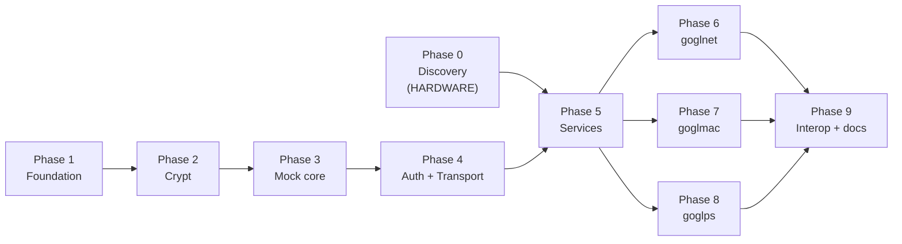

# gogl Implementation Plan

> **For agentic workers:** REQUIRED SUB-SKILL: Use superpowers:subagent-driven-development (recommended) or superpowers:executing-plans to implement this plan task-by-task. Steps use checkbox (`- [ ]`) syntax for tracking.

> ## Status: executed, and superseded in part
>
> This plan was written before any of it ran against hardware, and three of its premises turned
> out to be wrong. It is kept as the record of how the project was built, not as a description
> of what it now does. **For current behavior read [`../README.md`](../README.md) and
> [`DESIGN.md`](DESIGN.md); for the verified API surface read
> [`../GL_INET_4X_API_DOCUMENTATION.md`](../GL_INET_4X_API_DOCUMENTATION.md).**
>
> What changed, and where the plan is now wrong:
>
> 1. **A static bind does not create a DNS record.** The plan assumed the reservation's name
>    became a resolvable name. On firmware 4.3.28 it is a label and nothing more. DNS names come
>    from the router's host file via `dns.get_host` / `dns.set_host`, which this plan never
>    mentions. Anything below that treats a reservation as carrying a name is wrong.
> 2. **Reservations are no longer the only write.** `NetworkService.Set` writes the LAN address
>    and DHCP pool, and `HostsService` writes names and the DNS domain. Two ordering guards
>    replace the old "read-only everything else" rule.
> 3. **Endpoint names were guessed.** `dhcp.*` does not exist on this device; the real groups are
>    `lan.*` and `dns.*`. Every group and method constant below should be read as provisional.
>
> The plan's *method* held up: mock first, transport second, one transparent retry, no hardware
> in the test suite. It was the API assumptions that did not survive contact.

---
**Goal:** Build a Go module and three CLI utilities that import a `gofips`-exported ISC DHCP host file into a GL.iNet GL-SFT1200 travel router as static DHCP reservations with matching DNS names.

**Architecture:** A single JSON-RPC 2.0 transport over `POST /rpc` handles challenge/response login, session renewal, and one transparent retry on expiry. Small services sit on top. Every test runs against an in-process mock `/rpc` server, never hardware.

*As planned, only reservations were written. As built, `NetworkService` and `HostsService` write as well; see the status note above.*

**Tech Stack:** Go 1.22 (toolchain 1.26 available), `github.com/GehirnInc/crypt` for unix crypt(3), stdlib `net/http`, `net/http/httptest`, `text/tabwriter`. No other dependencies.

## Global Constraints

- Module path: `github.com/emergingrobotics/gogl`. Library under `src/`, imported as `github.com/emergingrobotics/gogl/src`, package name `gogl`.
- Every function MUST have a test. `make test` runs `go test -v -race -cover ./...`.
- Every endpoint MUST be supported in the mock server. Tests use the mock, not real hardware.
- No phase advances below 100% coverage of the code it adds.
- **No SSH, no shell.** Every device operation goes through an HTTP API. (Originally "no UCI"
  as well; moot in the end, since `/ubus` returns 404 on this device.)
- ~~**Reservations are the only thing gogl writes.**~~ Superseded: `NetworkService` and
  `HostsService` write too. See the status note above.
- No `site` parameter anywhere. GL.iNet routers have no sites.
- Emoji characters are forbidden in code.
- Comments explain WHY, never WHAT. Never comment out code.
- Errors are always handled explicitly; never ignored.
- No magic numbers; use named constants.
- Utilities build to `bin/`, never to the repo root.

---

## Phase Dependency



**Phases 1 through 4 need no hardware and no discovery output.** The authentication flow is
verified independently, so crypt, the mock, and the transport can all be built and fully
tested before a router is ever touched. Only Phase 5 onward depends on Phase 0's captured
group and method names.

Run Phase 0 first if hardware is at hand. If it is not, start at Phase 1 and slot Phase 0
in before Phase 5.

---

## Phase 0: API Discovery

GL.iNet's official 4.x API reference is no longer publicly reachable. Group and method
names must be captured from a live SFT1200. Nothing here is guessed.

### Task 1: Discovery harness

**Files:**
- Create: `discovery/probe.go`
- Create: `discovery/README.md`

**Interfaces:**
- Consumes: nothing. This task deliberately predates the library.
- Produces: a runnable probe that records verbatim JSON-RPC exchanges to `discovery/*.rpclog`. Later tasks consume the resulting fixtures, not this code.

`discovery/` is gitignored: transcripts may contain a live session id. Only reduced
fixtures get committed.

- [ ] **Step 1: Create the probe**

`discovery/probe.go`:

```go
// Command probe records verbatim JSON-RPC exchanges against a live GL.iNet
// router so that group and method names can be captured rather than guessed.
// It deliberately depends on nothing in src/, because src/ does not exist yet.
package main

import (
	"bytes"
	"crypto/md5"
	"encoding/hex"
	"encoding/json"
	"flag"
	"fmt"
	"io"
	"net/http"
	"os"
	"os/exec"
	"strings"
	"time"
)

func main() {
	host := flag.String("H", os.Getenv("GL_ROUTER_IP"), "router address")
	group := flag.String("group", "", "functional group to probe")
	method := flag.String("method", "", "method to probe")
	argsJSON := flag.String("args", "{}", "JSON object of arguments")
	flag.Parse()

	if *host == "" || *group == "" || *method == "" {
		fmt.Fprintln(os.Stderr, "usage: probe -H <ip> -group <g> -method <m> [-args '{...}']")
		os.Exit(1)
	}

	password := os.Getenv("GL_PASSWORD")
	if password == "" {
		fmt.Fprintln(os.Stderr, "GL_PASSWORD is not set")
		os.Exit(1)
	}

	url := "http://" + *host + "/rpc"
	log, err := os.OpenFile("discovery/probe.rpclog", os.O_APPEND|os.O_CREATE|os.O_WRONLY, 0600)
	if err != nil {
		fmt.Fprintln(os.Stderr, "open log:", err)
		os.Exit(1)
	}
	defer log.Close()

	sid, err := login(url, password, log)
	if err != nil {
		fmt.Fprintln(os.Stderr, "login:", err)
		os.Exit(1)
	}

	var args any
	if err := json.Unmarshal([]byte(*argsJSON), &args); err != nil {
		fmt.Fprintln(os.Stderr, "parse -args:", err)
		os.Exit(1)
	}

	body := map[string]any{
		"jsonrpc": "2.0",
		"id":      99,
		"method":  "call",
		"params":  []any{sid, *group, *method, args},
	}
	resp, err := post(url, body, log)
	if err != nil {
		fmt.Fprintln(os.Stderr, "call:", err)
		os.Exit(1)
	}
	fmt.Println(resp)
}

// login performs the two-challenge sequence. The first challenge supplies the
// salt; the second supplies a nonce that is still alive after the deliberately
// slow crypt step.
func login(url, password string, log io.Writer) (string, error) {
	type challengeResult struct {
		Alg   json.RawMessage `json:"alg"`
		Salt  string          `json:"salt"`
		Nonce string          `json:"nonce"`
	}

	challenge := func() (challengeResult, error) {
		body := map[string]any{
			"jsonrpc": "2.0", "id": 1, "method": "challenge",
			"params": map[string]any{"username": "root"},
		}
		raw, err := post(url, body, log)
		if err != nil {
			return challengeResult{}, err
		}
		var env struct {
			Result challengeResult `json:"result"`
		}
		if err := json.Unmarshal([]byte(raw), &env); err != nil {
			return challengeResult{}, err
		}
		return env.Result, nil
	}

	first, err := challenge()
	if err != nil {
		return "", err
	}
	alg := strings.Trim(string(first.Alg), `"`)

	// Shell out to openssl rather than pull in a dependency; this program is a
	// throwaway probe and must not constrain the module's dependency set.
	out, err := exec.Command("openssl", "passwd", "-"+alg, "-salt", first.Salt, password).Output()
	if err != nil {
		return "", fmt.Errorf("openssl passwd: %w", err)
	}
	cipher := strings.TrimSpace(string(out))

	second, err := challenge()
	if err != nil {
		return "", err
	}

	sum := md5.Sum([]byte("root:" + cipher + ":" + second.Nonce))
	body := map[string]any{
		"jsonrpc": "2.0", "id": 2, "method": "login",
		"params": map[string]any{"username": "root", "hash": hex.EncodeToString(sum[:])},
	}
	raw, err := post(url, body, log)
	if err != nil {
		return "", err
	}
	var env struct {
		Result struct {
			SID string `json:"sid"`
		} `json:"result"`
	}
	if err := json.Unmarshal([]byte(raw), &env); err != nil {
		return "", err
	}
	if env.Result.SID == "" {
		return "", fmt.Errorf("no sid in response: %s", raw)
	}
	return env.Result.SID, nil
}

func post(url string, body any, log io.Writer) (string, error) {
	b, err := json.Marshal(body)
	if err != nil {
		return "", err
	}
	fmt.Fprintf(log, "%s >>> %s\n", time.Now().Format(time.RFC3339Nano), b)

	resp, err := http.Post(url, "application/json", bytes.NewReader(b))
	if err != nil {
		return "", err
	}
	defer resp.Body.Close()
	out, err := io.ReadAll(resp.Body)
	if err != nil {
		return "", err
	}
	fmt.Fprintf(log, "%s <<< %s\n", time.Now().Format(time.RFC3339Nano), out)
	return string(out), nil
}
```

- [ ] **Step 2: Verify the probe authenticates**

```bash
mkdir -p discovery
export GL_ROUTER_IP=192.168.8.1
export GL_PASSWORD='<your router password>'
go run ./discovery -group system -method get_status
```

Expected: a JSON result, not an error. If `login` fails, the two-challenge sequence or the
`alg` handling is wrong — fix that before probing anything else, because every later probe
depends on it.

- [ ] **Step 3: Commit the probe**

```bash
git add discovery/probe.go discovery/README.md
git commit -m "chore(discovery): add JSON-RPC probe for API capture"
```

### Task 2: Capture fixtures and write the API reference

**Files:**
- Create: `src/mock/fixtures/*.json`
- Create: `GL_INET_4X_API_DOCUMENTATION.md`

**Interfaces:**
- Consumes: `discovery/probe.go` from Task 1.
- Produces: committed fixture files and a documented group/method table. Phase 5 reads both.

- [ ] **Step 1: Probe for each open item**

Work the table from `docs/DESIGN.md` § Phase 0. Candidate groups to try, in order of
likelihood — record what works and what returns an error:

```bash
for probe in \
  "system get_status" \
  "system get_info" \
  "network get_status" \
  "lan get_config" \
  "dhcp get_config" \
  "clients get_list" \
  "client get_list" ; do
    set -- $probe
    echo "=== $1 $2 ==="
    go run ./discovery -group "$1" -method "$2"
done
```

A group or method that does not exist returns a JSON-RPC `error` object. Record those too:
the error shape and code are themselves fixtures, needed for `RPCError.Unwrap`.

- [ ] **Step 2: Probe reservation write semantics**

This is the one open item that can change the design. Determine whether a reservation write
needs a separate apply or commit step:

```bash
# Read current reservations, note the shape.
go run ./discovery -group <reservation-group> -method get_config

# Add one, then immediately re-read WITHOUT any further call.
go run ./discovery -group <reservation-group> -method set_config \
  -args '{"...":"one reservation, shape from the read above"}'
go run ./discovery -group <reservation-group> -method get_config
```

Then verify from a client that the reservation is live: release and renew a DHCP lease on a
test device and confirm it receives the reserved address, and that the name resolves.

Record the answer explicitly in `GL_INET_4X_API_DOCUMENTATION.md`:

- If the re-read shows the new reservation **and** a client receives it with no further
  call, writes are immediate. Task 17 stays as planned.
- If a separate apply, commit, or reload call is required, note the exact call. Task 17 and
  Task 26 both grow a final apply step, and a partially-applied state becomes possible.

- [ ] **Step 3: Reduce transcripts to fixtures**

For each working call, save the `result` payload verbatim as
`src/mock/fixtures/<group>_<method>.json`. Strip nothing except the session id. These are
the API reference; do not tidy them into what you expected to see.

- [ ] **Step 4: Write the API documentation**

`GL_INET_4X_API_DOCUMENTATION.md` documents, per endpoint: group, method, argument object,
result shape, an example, and observed errors. Include the numeric error code table.

- [ ] **Step 5: Commit**

```bash
git add src/mock/fixtures/ GL_INET_4X_API_DOCUMENTATION.md
git commit -m "docs(api): capture GL.iNet 4.x endpoints from live SFT1200"
```

**Gate:** Do not start Phase 5 until every row in `docs/DESIGN.md` § Phase 0 is answered
and its fixture committed. Phases 1 through 4 may proceed regardless.

---

## Phase 1: Foundation

No hardware, no discovery output. Pure code and pure tests.

### Task 3: Module scaffolding and Makefile

**Files:**
- Create: `go.mod`
- Create: `Makefile`
- Create: `src/doc.go`

**Interfaces:**
- Consumes: nothing.
- Produces: a buildable module and `make test` / `make build` / `make lint` / `make coverage` / `make install` targets. Every later task runs `make test`.

- [ ] **Step 1: Initialise the module**

```bash
go mod init github.com/emergingrobotics/gogl
go mod edit -go=1.22
```

- [ ] **Step 2: Create the package doc**

`src/doc.go`:

```go
// Package gogl provides programmatic control of GL.iNet travel routers running
// firmware 4.x, targeting the GL-SFT1200 (Opal).
//
// The router exposes a single JSON-RPC 2.0 endpoint at POST /rpc. Authentication
// is challenge/response: the password is never transmitted, only a digest.
//
// Reservations are the only thing this package writes. Network configuration,
// clients, and system information are read-only; set network configuration in
// the GL.iNet admin panel.
package gogl
```

- [ ] **Step 3: Create the Makefile**

`Makefile`:

```makefile
.PHONY: all build test lint clean coverage examples examples-clean examples-test utilities utilities-clean install help

# All utilities. Mirrors gofi's UTILITIES := gofimac gofinet gofips one-for-one.
UTILITIES := goglmac goglnet goglps

# All examples
EXAMPLES := basic list reservations

# Install destination. Defaults to the user's ~/bin so no sudo is needed.
# Override with: make install INSTALL_DIR=/somewhere/else
INSTALL_DIR ?= $(HOME)/bin

.DEFAULT_GOAL := help

all: lint test build

# Build the module (compile-checks the whole tree) and the runnable utilities
# into bin/. Nothing is ever written to the repo root.
build: utilities
	go build ./...

test:
	go test -v -race -cover ./...

lint:
	golangci-lint run ./...

clean: examples-clean utilities-clean
	go clean ./...
	rm -rf coverage.out coverage.html

coverage:
	go test -coverprofile=coverage.out ./...
	go tool cover -html=coverage.out -o coverage.html

# === Examples ===

examples:
	@mkdir -p bin
	@for ex in $(EXAMPLES); do \
		echo "Building $$ex..."; \
		go build -o bin/$$ex ./examples/$$ex; \
	done
	@echo "All examples built in bin/"

examples-clean:
	rm -rf bin/

examples-test:
	@echo "Testing examples compile..."
	@for ex in $(EXAMPLES); do \
		echo "  Checking $$ex..."; \
		go build -o /dev/null ./examples/$$ex || exit 1; \
	done
	@echo "All examples compile successfully."

# === Utilities ===

utilities:
	@mkdir -p bin
	@for util in $(UTILITIES); do \
		echo "Building $$util..."; \
		go build -o bin/$$util ./utilities/$$util; \
	done
	@echo "All utilities built in bin/"

utilities-clean:
	rm -rf bin/

install: utilities
	@mkdir -p $(INSTALL_DIR)
	@for util in $(UTILITIES); do \
		echo "Installing $$util to $(INSTALL_DIR)/$$util"; \
		install -m 755 bin/$$util $(INSTALL_DIR)/$$util; \
	done
	@echo "All utilities installed to $(INSTALL_DIR)."
	@case ":$$PATH:" in *":$(INSTALL_DIR):"*) ;; *) echo "Note: $(INSTALL_DIR) is not on your PATH.";; esac

help:
	@echo "Usage: make [target]"
	@echo ""
	@echo "Main targets:"
	@echo "  all           Run lint, test, and build"
	@echo "  build         Build the module and utilities into bin/"
	@echo "  test          Run all tests"
	@echo "  lint          Run linter"
	@echo "  clean         Clean all build artifacts"
	@echo "  coverage      Generate coverage report"
	@echo ""
	@echo "Example targets:"
	@echo "  examples        Build all examples to bin/"
	@echo "  examples-clean  Remove example binaries"
	@echo "  examples-test   Verify all examples compile"
	@echo ""
	@echo "Utility targets:"
	@echo "  utilities       Build all utilities to bin/"
	@echo "  utilities-clean Remove utility binaries"
	@echo "  install         Build and install utilities to ~/bin (override INSTALL_DIR)"
```

- [ ] **Step 4: Verify it builds**

Run: `go build ./... && make help`
Expected: no output from the build, help text printed.

- [ ] **Step 5: Commit**

```bash
git add go.mod Makefile src/doc.go
git commit -m "chore: scaffold module and Makefile"
```

### Task 4: Sentinel errors and RPCError

**Files:**
- Create: `src/errors.go`
- Test: `src/errors_test.go`

**Interfaces:**
- Consumes: nothing.
- Produces: `gogl.ErrUnauthorized`, `ErrSessionExpired`, `ErrNonceExpired`, `ErrUnsupportedAlgorithm`, `ErrNotFound`, `ErrConflict`, `ErrInvalidName`, `ErrOutsideSubnet`, and `type RPCError struct { Code int; Message, Group, Method string }` with `Error() string` and `Unwrap() error`. Every later task returns these.

- [ ] **Step 1: Write the failing test**

`src/errors_test.go`:

```go
package gogl

import (
	"errors"
	"testing"
)

func TestRPCErrorError(t *testing.T) {
	err := &RPCError{Code: -32000, Message: "Access denied", Group: "lan", Method: "get_config"}
	want := "gogl: rpc error -32000 on lan.get_config: Access denied"
	if got := err.Error(); got != want {
		t.Errorf("Error() = %q, want %q", got, want)
	}
}

func TestRPCErrorUnwrap(t *testing.T) {
	tests := []struct {
		name string
		code int
		want error
	}{
		{"access denied maps to session expired", CodeAccessDenied, ErrSessionExpired},
		{"not found", CodeNotFound, ErrNotFound},
		{"unknown code unwraps to nil", -1, nil},
	}
	for _, tt := range tests {
		t.Run(tt.name, func(t *testing.T) {
			err := &RPCError{Code: tt.code}
			if got := err.Unwrap(); !errors.Is(got, tt.want) {
				t.Errorf("Unwrap() = %v, want %v", got, tt.want)
			}
		})
	}
}

func TestRPCErrorIsThroughWrapping(t *testing.T) {
	var err error = &RPCError{Code: CodeAccessDenied}
	if !errors.Is(err, ErrSessionExpired) {
		t.Error("errors.Is(err, ErrSessionExpired) = false, want true")
	}
}
```

- [ ] **Step 2: Run the test to verify it fails**

Run: `go test ./src/ -run TestRPCError -v`
Expected: FAIL, `undefined: RPCError`.

- [ ] **Step 3: Write the implementation**

`src/errors.go`:

```go
package gogl

import (
	"errors"
	"fmt"
)

var (
	// ErrUnauthorized means the router rejected the credentials.
	ErrUnauthorized = errors.New("gogl: unauthorized")

	// ErrSessionExpired means the sid was stale. Normally handled internally by
	// one transparent re-login; surfaced only when that re-login also fails.
	ErrSessionExpired = errors.New("gogl: session expired")

	// ErrNonceExpired means the login nonce died before it was used. Retriable.
	ErrNonceExpired = errors.New("gogl: challenge nonce expired")

	// ErrUnsupportedAlgorithm means the challenge named a crypt algorithm this
	// package does not implement. Never falls back to a weaker algorithm,
	// because a silent downgrade is worse than a failed login.
	ErrUnsupportedAlgorithm = errors.New("gogl: unsupported crypt algorithm")

	ErrNotFound = errors.New("gogl: not found")
	ErrConflict = errors.New("gogl: conflict")

	// ErrInvalidName means a reservation name failed validation. Returned rather
	// than escaped: GL.iNet writes the name into dnsmasq's configuration file,
	// and a bad character there breaks DHCP and DNS for the whole router.
	ErrInvalidName = errors.New("gogl: invalid reservation name")

	// ErrOutsideSubnet means an address does not fall inside the router's LAN.
	ErrOutsideSubnet = errors.New("gogl: address outside LAN subnet")
)

// JSON-RPC error codes observed from GL.iNet firmware 4.x. Populated from
// recorded fixtures during Phase 0; extend as more are captured.
const (
	CodeAccessDenied = -32000
	CodeNotFound     = -32001
)

// RPCError is a JSON-RPC error returned by the router. It carries the group and
// method that produced it so a failure is traceable to a call site.
type RPCError struct {
	Code    int
	Message string
	Group   string
	Method  string
}

func (e *RPCError) Error() string {
	return fmt.Sprintf("gogl: rpc error %d on %s.%s: %s", e.Code, e.Group, e.Method, e.Message)
}

// Unwrap maps the router's numeric codes onto package sentinels so callers can
// use errors.Is without knowing the wire codes.
func (e *RPCError) Unwrap() error {
	switch e.Code {
	case CodeAccessDenied:
		return ErrSessionExpired
	case CodeNotFound:
		return ErrNotFound
	default:
		return nil
	}
}
```

- [ ] **Step 4: Run the test to verify it passes**

Run: `go test ./src/ -run TestRPCError -v -race`
Expected: PASS, all three tests.

- [ ] **Step 5: Commit**

```bash
git add src/errors.go src/errors_test.go
git commit -m "feat(errors): add sentinels and RPCError with code mapping"
```

### Task 5: LeaseTime

**Files:**
- Create: `src/types/leasetime.go`
- Test: `src/types/leasetime_test.go`

**Interfaces:**
- Consumes: nothing.
- Produces: `types.LeaseTime` (a `time.Duration`), `types.LeaseInfinite`, with `UnmarshalJSON`, `MarshalJSON`, `String()`, and `Seconds() int64`. Task 7 embeds it in `Network`; Task 20 prints it.

`LeaseTime` bridges two formats. UniFi's `dhcpd_leasetime` is always an integer of seconds;
dnsmasq uses duration strings. Only unmarshalling matters for device reads, since gogl never
writes network configuration — marshalling exists solely for `goglnet -j` output, where we
choose the format.

- [ ] **Step 1: Write the failing test**

`src/types/leasetime_test.go`:

```go
package types

import (
	"encoding/json"
	"testing"
	"time"
)

func TestLeaseTimeUnmarshal(t *testing.T) {
	tests := []struct {
		name  string
		input string
		want  LeaseTime
	}{
		{"hours", `"12h"`, LeaseTime(12 * time.Hour)},
		{"days", `"1d"`, LeaseTime(24 * time.Hour)},
		{"weeks", `"2w"`, LeaseTime(14 * 24 * time.Hour)},
		{"minutes", `"30m"`, LeaseTime(30 * time.Minute)},
		{"seconds suffix", `"90s"`, LeaseTime(90 * time.Second)},
		{"bare seconds as number", `86400`, LeaseTime(24 * time.Hour)},
		{"bare seconds as string", `"86400"`, LeaseTime(24 * time.Hour)},
		{"infinite", `"infinite"`, LeaseInfinite},
	}
	for _, tt := range tests {
		t.Run(tt.name, func(t *testing.T) {
			var got LeaseTime
			if err := json.Unmarshal([]byte(tt.input), &got); err != nil {
				t.Fatalf("Unmarshal(%s) error: %v", tt.input, err)
			}
			if got != tt.want {
				t.Errorf("Unmarshal(%s) = %v, want %v", tt.input, time.Duration(got), time.Duration(tt.want))
			}
		})
	}
}

func TestLeaseTimeUnmarshalError(t *testing.T) {
	for _, input := range []string{`"12x"`, `"forever"`, `""`, `[]`} {
		var got LeaseTime
		if err := json.Unmarshal([]byte(input), &got); err == nil {
			t.Errorf("Unmarshal(%s) succeeded, want error", input)
		}
	}
}

func TestLeaseTimeString(t *testing.T) {
	tests := []struct {
		lease LeaseTime
		want  string
	}{
		{LeaseTime(12 * time.Hour), "12h"},
		{LeaseTime(24 * time.Hour), "24h"},
		{LeaseTime(30 * time.Minute), "30m"},
		{LeaseTime(90 * time.Second), "1m30s"},
		{LeaseInfinite, "infinite"},
		{LeaseTime(0), "0s"},
	}
	for _, tt := range tests {
		if got := tt.lease.String(); got != tt.want {
			t.Errorf("String() = %q, want %q", got, tt.want)
		}
	}
}

func TestLeaseTimeMarshalRoundTrip(t *testing.T) {
	for _, want := range []LeaseTime{LeaseTime(12 * time.Hour), LeaseInfinite, LeaseTime(90 * time.Second)} {
		b, err := json.Marshal(want)
		if err != nil {
			t.Fatalf("Marshal(%v) error: %v", want, err)
		}
		var got LeaseTime
		if err := json.Unmarshal(b, &got); err != nil {
			t.Fatalf("Unmarshal(%s) error: %v", b, err)
		}
		if got != want {
			t.Errorf("round trip via %s = %v, want %v", b, got, want)
		}
	}
}

func TestLeaseTimeSeconds(t *testing.T) {
	if got := LeaseTime(12 * time.Hour).Seconds(); got != 43200 {
		t.Errorf("Seconds() = %d, want 43200", got)
	}
	if got := LeaseInfinite.Seconds(); got != -1 {
		t.Errorf("LeaseInfinite.Seconds() = %d, want -1", got)
	}
}
```

- [ ] **Step 2: Run the test to verify it fails**

Run: `go test ./src/types/ -run TestLeaseTime -v`
Expected: FAIL, `undefined: LeaseTime`.

- [ ] **Step 3: Write the implementation**

`src/types/leasetime.go`:

```go
package types

import (
	"encoding/json"
	"fmt"
	"math"
	"strconv"
	"strings"
	"time"
)

// LeaseInfinite represents dnsmasq's "infinite" lease. It is a sentinel rather
// than a very large duration so that arithmetic on it cannot silently overflow.
const LeaseInfinite = LeaseTime(math.MaxInt64)

const (
	hoursPerDay  = 24
	daysPerWeek  = 7
	infiniteText = "infinite"
)

// LeaseTime is a DHCP lease duration. It unmarshals from a dnsmasq duration
// string ("12h", "1d", "2w", "infinite") or a bare count of seconds, and
// marshals to the dnsmasq duration form. This bridges UniFi's dhcpd_leasetime,
// which is always an integer of seconds, and dnsmasq's string form.
type LeaseTime time.Duration

// UnmarshalJSON accepts a JSON number of seconds or a duration string. Both
// forms occur: UniFi emits numbers, dnsmasq emits strings.
func (l *LeaseTime) UnmarshalJSON(b []byte) error {
	var asNumber int64
	if err := json.Unmarshal(b, &asNumber); err == nil {
		*l = LeaseTime(time.Duration(asNumber) * time.Second)
		return nil
	}

	var asString string
	if err := json.Unmarshal(b, &asString); err != nil {
		return fmt.Errorf("lease time: not a number or string: %s", b)
	}

	parsed, err := parseLeaseString(asString)
	if err != nil {
		return err
	}
	*l = parsed
	return nil
}

// parseLeaseString handles dnsmasq's duration vocabulary. time.ParseDuration
// covers s, m and h but rejects d and w, which dnsmasq uses, so those are
// converted before delegating.
func parseLeaseString(s string) (LeaseTime, error) {
	s = strings.TrimSpace(s)
	if s == "" {
		return 0, fmt.Errorf("lease time: empty")
	}
	if s == infiniteText {
		return LeaseInfinite, nil
	}

	if seconds, err := strconv.ParseInt(s, 10, 64); err == nil {
		return LeaseTime(time.Duration(seconds) * time.Second), nil
	}

	value, unit := s[:len(s)-1], s[len(s)-1]
	switch unit {
	case 'd', 'w':
		n, err := strconv.ParseInt(value, 10, 64)
		if err != nil {
			return 0, fmt.Errorf("lease time: bad quantity in %q", s)
		}
		hours := n * hoursPerDay
		if unit == 'w' {
			hours *= daysPerWeek
		}
		return LeaseTime(time.Duration(hours) * time.Hour), nil
	}

	d, err := time.ParseDuration(s)
	if err != nil {
		return 0, fmt.Errorf("lease time: unrecognized duration %q", s)
	}
	return LeaseTime(d), nil
}

// MarshalJSON emits the duration string form. gogl never writes network
// configuration to the router, so this serves only the utilities' own JSON
// output, where the friendlier form is the useful one.
func (l LeaseTime) MarshalJSON() ([]byte, error) {
	return json.Marshal(l.String())
}

func (l LeaseTime) String() string {
	if l == LeaseInfinite {
		return infiniteText
	}
	return time.Duration(l).String()
}

// Seconds returns the lease in whole seconds, or -1 for an infinite lease.
func (l LeaseTime) Seconds() int64 {
	if l == LeaseInfinite {
		return -1
	}
	return int64(time.Duration(l).Seconds())
}
```

- [ ] **Step 4: Run the test to verify it passes**

Run: `go test ./src/types/ -run TestLeaseTime -v -race`
Expected: PASS. Note `12h` round-trips as `12h0m0s` from `time.Duration.String()`, which
`parseLeaseString` accepts via `time.ParseDuration` — so the round-trip test passes while
`TestLeaseTimeString` pins the display form. If `TestLeaseTimeString` fails on `"12h"`
versus `"12h0m0s"`, trim a trailing `0m0s` and `0s` in `String()` rather than loosening the
test.

- [ ] **Step 5: Commit**

```bash
git add src/types/leasetime.go src/types/leasetime_test.go
git commit -m "feat(types): add LeaseTime bridging seconds and dnsmasq durations"
```

### Task 6: Reservation and name validation

**Files:**
- Create: `src/types/reservation.go`
- Test: `src/types/reservation_test.go`

**Interfaces:**
- Consumes: `gogl.ErrInvalidName` from Task 4. To avoid an import cycle (`types` must not import `gogl`), the sentinels live in `types` and `gogl` re-exports them; declare `ErrInvalidName` and `ErrOutsideSubnet` in `src/types/errors.go` and change `src/errors.go` to `var ErrInvalidName = types.ErrInvalidName`.
- Produces: `types.Reservation{Name, MAC, IP string; Enabled bool}`, `(*Reservation).Validate() error`, `types.ValidateName(string) error`, `types.NormalizeMAC(string) (string, error)`. Tasks 17, 23, 25, 26, 27 all use these.

- [ ] **Step 1: Move the two sentinels into types**

`src/types/errors.go`:

```go
package types

import "errors"

var (
	// ErrInvalidName means a reservation name failed validation. Returned rather
	// than escaped: GL.iNet writes the name into dnsmasq's configuration file,
	// and a bad character there breaks DHCP and DNS for the whole router.
	ErrInvalidName = errors.New("gogl: invalid reservation name")

	// ErrOutsideSubnet means an address does not fall inside the router's LAN.
	ErrOutsideSubnet = errors.New("gogl: address outside LAN subnet")

	// ErrInvalidMAC means a MAC address was not parseable.
	ErrInvalidMAC = errors.New("gogl: invalid MAC address")

	// ErrInvalidIP means an address was not a valid IPv4 address.
	ErrInvalidIP = errors.New("gogl: invalid IPv4 address")
)
```

Then in `src/errors.go`, replace the `ErrInvalidName` and `ErrOutsideSubnet` declarations
with re-exports so callers can use either package's name interchangeably:

```go
// Re-exported from types so that consumers of the root package need not import
// types just to test for a validation failure. Same values, so errors.Is works
// across both.
var (
	ErrInvalidName    = types.ErrInvalidName
	ErrOutsideSubnet  = types.ErrOutsideSubnet
	ErrInvalidMAC     = types.ErrInvalidMAC
	ErrInvalidIP      = types.ErrInvalidIP
)
```

Add the import `"github.com/emergingrobotics/gogl/src/types"` to `src/errors.go`.

- [ ] **Step 2: Write the failing test**

`src/types/reservation_test.go`:

```go
package types

import (
	"errors"
	"strings"
	"testing"
)

func TestValidateNameAccepts(t *testing.T) {
	valid := []string{
		"nas",
		"my-server",
		"host1",
		"a",
		"aa-bb-cc-dd-ee-ff",
		"printer.lab",
		strings.Repeat("a", 63),
	}
	for _, name := range valid {
		if err := ValidateName(name); err != nil {
			t.Errorf("ValidateName(%q) = %v, want nil", name, err)
		}
	}
}

func TestValidateNameRejects(t *testing.T) {
	tests := []struct {
		name  string
		input string
	}{
		{"empty", ""},
		{"underscore is legal on UniFi but not in DNS", "my_server"},
		{"double quote can corrupt dnsmasq config", `my"server`},
		{"single quote", "my'server"},
		{"space", "my server"},
		{"semicolon", "my;server"},
		{"newline", "my\nserver"},
		{"leading hyphen", "-nas"},
		{"trailing hyphen", "nas-"},
		{"leading dot", ".nas"},
		{"trailing dot", "nas."},
		{"empty label", "a..b"},
		{"label too long", strings.Repeat("a", 64)},
		{"total too long", strings.Repeat("a.", 127) + "a"},
	}
	for _, tt := range tests {
		t.Run(tt.name, func(t *testing.T) {
			err := ValidateName(tt.input)
			if err == nil {
				t.Fatalf("ValidateName(%q) = nil, want error", tt.input)
			}
			if !errors.Is(err, ErrInvalidName) {
				t.Errorf("ValidateName(%q) error = %v, want ErrInvalidName", tt.input, err)
			}
		})
	}
}

// The error must name the offending character so the operator can find it in a
// host file without guessing.
func TestValidateNameErrorNamesCharacter(t *testing.T) {
	err := ValidateName("my_server")
	if err == nil {
		t.Fatal("expected error")
	}
	if !strings.Contains(err.Error(), "_") {
		t.Errorf("error %q does not name the offending character", err)
	}
}

func TestNormalizeMAC(t *testing.T) {
	tests := []struct {
		input string
		want  string
	}{
		{"AA:BB:CC:DD:EE:FF", "aa:bb:cc:dd:ee:ff"},
		{"aa:bb:cc:dd:ee:ff", "aa:bb:cc:dd:ee:ff"},
		{"aa-bb-cc-dd-ee-ff", "aa:bb:cc:dd:ee:ff"},
		{"AABBCCDDEEFF", "aa:bb:cc:dd:ee:ff"},
	}
	for _, tt := range tests {
		got, err := NormalizeMAC(tt.input)
		if err != nil {
			t.Errorf("NormalizeMAC(%q) error: %v", tt.input, err)
			continue
		}
		if got != tt.want {
			t.Errorf("NormalizeMAC(%q) = %q, want %q", tt.input, got, tt.want)
		}
	}
}

func TestNormalizeMACRejects(t *testing.T) {
	for _, input := range []string{"", "aa:bb:cc", "zz:bb:cc:dd:ee:ff", "aa:bb:cc:dd:ee:ff:00"} {
		if _, err := NormalizeMAC(input); !errors.Is(err, ErrInvalidMAC) {
			t.Errorf("NormalizeMAC(%q) error = %v, want ErrInvalidMAC", input, err)
		}
	}
}

func TestReservationValidate(t *testing.T) {
	good := &Reservation{Name: "nas", MAC: "AA:BB:CC:DD:EE:01", IP: "192.168.8.10"}
	if err := good.Validate(); err != nil {
		t.Fatalf("Validate() = %v, want nil", err)
	}
	// Validate normalizes in place so the service layer always writes lowercase.
	if good.MAC != "aa:bb:cc:dd:ee:01" {
		t.Errorf("Validate did not normalize MAC: got %q", good.MAC)
	}
}

func TestReservationValidateRejects(t *testing.T) {
	tests := []struct {
		name string
		res  Reservation
		want error
	}{
		{"bad name", Reservation{Name: "my_nas", MAC: "aa:bb:cc:dd:ee:01", IP: "192.168.8.10"}, ErrInvalidName},
		{"bad mac", Reservation{Name: "nas", MAC: "nope", IP: "192.168.8.10"}, ErrInvalidMAC},
		{"bad ip", Reservation{Name: "nas", MAC: "aa:bb:cc:dd:ee:01", IP: "999.1.1.1"}, ErrInvalidIP},
		{"ipv6 rejected", Reservation{Name: "nas", MAC: "aa:bb:cc:dd:ee:01", IP: "fe80::1"}, ErrInvalidIP},
	}
	for _, tt := range tests {
		t.Run(tt.name, func(t *testing.T) {
			if err := tt.res.Validate(); !errors.Is(err, tt.want) {
				t.Errorf("Validate() = %v, want %v", err, tt.want)
			}
		})
	}
}
```

- [ ] **Step 3: Run the test to verify it fails**

Run: `go test ./src/types/ -run 'TestValidateName|TestNormalizeMAC|TestReservation' -v`
Expected: FAIL, `undefined: ValidateName`.

- [ ] **Step 4: Write the implementation**

`src/types/reservation.go`:

```go
package types

import (
	"fmt"
	"net"
	"strings"
)

const (
	maxNameLength  = 253
	maxLabelLength = 63
	macOctets      = 6
)

// Reservation is a static DHCP lease. On GL.iNet firmware the lease's Name is
// written into dnsmasq's configuration, so dnsmasq answers DNS queries for it.
// One Reservation therefore provides both the DHCP binding and the DNS record;
// they cannot disagree, and neither can exist without the other.
type Reservation struct {
	// Name is the dnsmasq hostname. Resolves bare and suffixed with the router's
	// domain, so "nas" answers as both "nas" and "nas.lan".
	Name string `json:"name"`

	// MAC is the client identity, lowercase colon-separated. It is the key for
	// update and delete: it is the only thing a client cannot change about
	// itself, and it is what dnsmasq keys the lease on.
	MAC string `json:"mac"`

	// IP is the reserved IPv4 address.
	IP string `json:"ip"`

	Enabled bool `json:"enabled"`
}

// Validate reports whether r is fit to write, normalizing MAC to lowercase
// colon-separated form in place. The service layer calls this before every
// write so that no consumer can bypass it.
func (r *Reservation) Validate() error {
	if err := ValidateName(r.Name); err != nil {
		return err
	}

	mac, err := NormalizeMAC(r.MAC)
	if err != nil {
		return err
	}
	r.MAC = mac

	ip := net.ParseIP(r.IP)
	if ip == nil || ip.To4() == nil {
		return fmt.Errorf("%w: %q", ErrInvalidIP, r.IP)
	}

	return nil
}

// ValidateName enforces the DNS label rules that protect dnsmasq's
// configuration file. It rejects rather than escapes, and names the offending
// character, because a quote or semicolon in this field can corrupt the config
// and break DHCP and DNS for the entire router.
//
// This is deliberately stricter than gofips, which permits underscores. An
// underscore is legal in a UniFi record but is not a legal DNS label character.
func ValidateName(name string) error {
	if name == "" {
		return fmt.Errorf("%w: empty", ErrInvalidName)
	}
	if len(name) > maxNameLength {
		return fmt.Errorf("%w: %d characters exceeds maximum of %d", ErrInvalidName, len(name), maxNameLength)
	}
	if strings.HasPrefix(name, "-") || strings.HasPrefix(name, ".") {
		return fmt.Errorf("%w: %q must not begin with %q", ErrInvalidName, name, name[:1])
	}
	if strings.HasSuffix(name, "-") || strings.HasSuffix(name, ".") {
		return fmt.Errorf("%w: %q must not end with %q", ErrInvalidName, name, name[len(name)-1:])
	}

	for _, label := range strings.Split(name, ".") {
		if label == "" {
			return fmt.Errorf("%w: %q contains an empty label", ErrInvalidName, name)
		}
		if len(label) > maxLabelLength {
			return fmt.Errorf("%w: label %q exceeds %d characters", ErrInvalidName, label, maxLabelLength)
		}
		for _, c := range label {
			if !isNameRune(c) {
				return fmt.Errorf("%w: %q contains %q, which is not permitted (allowed: letters, digits, hyphen, and dot as a separator)",
					ErrInvalidName, name, string(c))
			}
		}
	}
	return nil
}

func isNameRune(c rune) bool {
	switch {
	case c >= 'a' && c <= 'z':
		return true
	case c >= 'A' && c <= 'Z':
		return true
	case c >= '0' && c <= '9':
		return true
	case c == '-':
		return true
	default:
		return false
	}
}

// NormalizeMAC parses any form net.ParseMAC accepts and returns the lowercase
// colon-separated form used everywhere in this module.
func NormalizeMAC(mac string) (string, error) {
	trimmed := strings.TrimSpace(mac)
	if trimmed == "" {
		return "", fmt.Errorf("%w: empty", ErrInvalidMAC)
	}

	// net.ParseMAC does not accept the unseparated form, which appears in IEEE
	// OUI files and occasionally in hand-written host files.
	if len(trimmed) == macOctets*2 && !strings.ContainsAny(trimmed, ":-.") {
		var b strings.Builder
		for i := 0; i < len(trimmed); i += 2 {
			if i > 0 {
				b.WriteByte(':')
			}
			b.WriteString(trimmed[i : i+2])
		}
		trimmed = b.String()
	}

	parsed, err := net.ParseMAC(trimmed)
	if err != nil {
		return "", fmt.Errorf("%w: %q", ErrInvalidMAC, mac)
	}
	if len(parsed) != macOctets {
		return "", fmt.Errorf("%w: %q is not a 6-octet address", ErrInvalidMAC, mac)
	}
	return strings.ToLower(parsed.String()), nil
}
```

- [ ] **Step 5: Run the tests to verify they pass**

Run: `go test ./src/... -v -race`
Expected: PASS, including the pre-existing Task 4 and Task 5 tests.

- [ ] **Step 6: Commit**

```bash
git add src/types/errors.go src/types/reservation.go src/types/reservation_test.go src/errors.go
git commit -m "feat(types): add Reservation with strict dnsmasq-safe name validation"
```

### Task 7: Network and subnet arithmetic

**Files:**
- Create: `src/internal/ipmath/ipmath.go`
- Test: `src/internal/ipmath/ipmath_test.go`
- Create: `src/types/network.go`
- Test: `src/types/network_test.go`

**Interfaces:**
- Consumes: `types.LeaseTime` (Task 5), `types.ErrOutsideSubnet` (Task 6).
- Produces: `ipmath.ToUint32(net.IP) uint32`, `ipmath.InRange(ip, start, stop net.IP) bool`, `ipmath.SubnetFrom(ip, mask string) (*net.IPNet, error)`, `ipmath.UsableHosts(*net.IPNet) int`; and `types.Network` with `Subnet()`, `Contains()`, `InDHCPPool()`, `PoolSize()`. Tasks 16, 20, 26 use these.

**Correction from execution:** this task originally placed `ipmath` under `src/internal/`.
That is wrong. The utilities are separate main packages outside `src/`, so Go's internal
rule makes it unimportable from exactly the consumers that need it, and `goglmac` fails to
build. Use `src/ipmath/` (public). The paths below have not been rewritten; substitute
`src/ipmath` for `src/internal/ipmath` throughout this task and in Tasks 22 and 24.

- [ ] **Step 1: Write the failing ipmath test**

`src/internal/ipmath/ipmath_test.go`:

```go
package ipmath

import (
	"net"
	"testing"
)

func TestToUint32(t *testing.T) {
	tests := []struct {
		ip   string
		want uint32
	}{
		{"0.0.0.0", 0},
		{"0.0.0.1", 1},
		{"0.0.1.0", 256},
		{"192.168.8.1", 3232237569},
		{"255.255.255.255", 4294967295},
	}
	for _, tt := range tests {
		if got := ToUint32(net.ParseIP(tt.ip)); got != tt.want {
			t.Errorf("ToUint32(%s) = %d, want %d", tt.ip, got, tt.want)
		}
	}
}

// Sorting by uint32 must order numerically, not lexically: the whole point is
// that 192.168.8.9 precedes 192.168.8.10.
func TestToUint32OrdersNumerically(t *testing.T) {
	nine := ToUint32(net.ParseIP("192.168.8.9"))
	ten := ToUint32(net.ParseIP("192.168.8.10"))
	if nine >= ten {
		t.Errorf("192.168.8.9 (%d) should sort before 192.168.8.10 (%d)", nine, ten)
	}
}

func TestInRange(t *testing.T) {
	start, stop := net.ParseIP("192.168.8.100"), net.ParseIP("192.168.8.249")
	tests := []struct {
		ip   string
		want bool
	}{
		{"192.168.8.99", false},
		{"192.168.8.100", true},
		{"192.168.8.175", true},
		{"192.168.8.249", true},
		{"192.168.8.250", false},
	}
	for _, tt := range tests {
		if got := InRange(net.ParseIP(tt.ip), start, stop); got != tt.want {
			t.Errorf("InRange(%s) = %v, want %v", tt.ip, got, tt.want)
		}
	}
}

func TestSubnetFrom(t *testing.T) {
	n, err := SubnetFrom("192.168.8.1", "255.255.255.0")
	if err != nil {
		t.Fatalf("SubnetFrom error: %v", err)
	}
	if got := n.String(); got != "192.168.8.0/24" {
		t.Errorf("SubnetFrom = %s, want 192.168.8.0/24", got)
	}
}

func TestSubnetFromRejects(t *testing.T) {
	for _, tt := range []struct{ ip, mask string }{
		{"", "255.255.255.0"},
		{"192.168.8.1", ""},
		{"192.168.8.1", "not-a-mask"},
		{"nope", "255.255.255.0"},
	} {
		if _, err := SubnetFrom(tt.ip, tt.mask); err == nil {
			t.Errorf("SubnetFrom(%q, %q) succeeded, want error", tt.ip, tt.mask)
		}
	}
}

func TestUsableHosts(t *testing.T) {
	tests := []struct {
		cidr string
		want int
	}{
		{"192.168.8.0/24", 254},
		{"192.168.0.0/16", 65534},
		{"192.168.8.0/30", 2},
	}
	for _, tt := range tests {
		_, n, err := net.ParseCIDR(tt.cidr)
		if err != nil {
			t.Fatalf("ParseCIDR(%s): %v", tt.cidr, err)
		}
		if got := UsableHosts(n); got != tt.want {
			t.Errorf("UsableHosts(%s) = %d, want %d", tt.cidr, got, tt.want)
		}
	}
}
```

- [ ] **Step 2: Run it to verify it fails**

Run: `go test ./src/internal/ipmath/ -v`
Expected: FAIL, `undefined: ToUint32`.

- [ ] **Step 3: Write ipmath**

`src/internal/ipmath/ipmath.go`:

```go
// Package ipmath provides the IPv4 arithmetic shared by gogl's services and
// utilities: numeric ordering, range containment, and subnet derivation.
package ipmath

import (
	"encoding/binary"
	"fmt"
	"net"
)

const (
	ipv4Bits = 32
	// networkAndBroadcast accounts for the two addresses in any subnet wider
	// than a /31 that cannot be assigned to a host.
	networkAndBroadcast = 2
)

// ToUint32 converts an IPv4 address to its numeric value so that addresses sort
// numerically rather than lexically. A non-IPv4 address yields 0.
func ToUint32(ip net.IP) uint32 {
	v4 := ip.To4()
	if v4 == nil {
		return 0
	}
	return binary.BigEndian.Uint32(v4)
}

// InRange reports whether ip lies within [start, stop] inclusive.
func InRange(ip, start, stop net.IP) bool {
	n := ToUint32(ip)
	return n >= ToUint32(start) && n <= ToUint32(stop)
}

// SubnetFrom derives the CIDR network containing ip under mask, which is how
// GL.iNet reports LAN configuration: an address plus a dotted-quad netmask.
func SubnetFrom(ip, mask string) (*net.IPNet, error) {
	parsedIP := net.ParseIP(ip)
	if parsedIP == nil || parsedIP.To4() == nil {
		return nil, fmt.Errorf("ipmath: %q is not an IPv4 address", ip)
	}
	parsedMask := net.ParseIP(mask)
	if parsedMask == nil || parsedMask.To4() == nil {
		return nil, fmt.Errorf("ipmath: %q is not an IPv4 netmask", mask)
	}

	m := net.IPMask(parsedMask.To4())
	if ones, bits := m.Size(); ones == 0 && bits == 0 {
		return nil, fmt.Errorf("ipmath: %q is not a contiguous netmask", mask)
	}

	return &net.IPNet{IP: parsedIP.Mask(m), Mask: m}, nil
}

// UsableHosts returns the count of assignable host addresses in n, excluding
// the network and broadcast addresses.
func UsableHosts(n *net.IPNet) int {
	ones, bits := n.Mask.Size()
	if bits != ipv4Bits {
		return 0
	}
	hostBits := bits - ones
	if hostBits < 2 {
		return 0
	}
	return (1 << hostBits) - networkAndBroadcast
}
```

- [ ] **Step 4: Write the failing Network test**

`src/types/network_test.go`:

```go
package types

import (
	"encoding/json"
	"net"
	"testing"
	"time"
)

func testNetwork() *Network {
	return &Network{
		LANIP:       "192.168.8.1",
		Netmask:     "255.255.255.0",
		DHCPEnabled: true,
		DHCPStart:   "192.168.8.100",
		DHCPStop:    "192.168.8.249",
		DHCPLease:   LeaseTime(12 * time.Hour),
		Domain:      "lan",
		DNS:         []string{"192.168.8.1"},
	}
}

func TestNetworkSubnet(t *testing.T) {
	n, err := testNetwork().Subnet()
	if err != nil {
		t.Fatalf("Subnet() error: %v", err)
	}
	if got := n.String(); got != "192.168.8.0/24" {
		t.Errorf("Subnet() = %s, want 192.168.8.0/24", got)
	}
}

func TestNetworkContains(t *testing.T) {
	n := testNetwork()
	tests := []struct {
		ip   string
		want bool
	}{
		{"192.168.8.10", true},
		{"192.168.8.1", true},
		{"192.168.8.254", true},
		{"192.168.4.10", false},
		{"10.0.0.1", false},
	}
	for _, tt := range tests {
		got, err := n.Contains(net.ParseIP(tt.ip))
		if err != nil {
			t.Fatalf("Contains(%s) error: %v", tt.ip, err)
		}
		if got != tt.want {
			t.Errorf("Contains(%s) = %v, want %v", tt.ip, got, tt.want)
		}
	}
}

func TestNetworkInDHCPPool(t *testing.T) {
	n := testNetwork()
	tests := []struct {
		ip   string
		want bool
	}{
		{"192.168.8.10", false},
		{"192.168.8.99", false},
		{"192.168.8.100", true},
		{"192.168.8.200", true},
		{"192.168.8.249", true},
		{"192.168.8.250", false},
	}
	for _, tt := range tests {
		got, err := n.InDHCPPool(net.ParseIP(tt.ip))
		if err != nil {
			t.Fatalf("InDHCPPool(%s) error: %v", tt.ip, err)
		}
		if got != tt.want {
			t.Errorf("InDHCPPool(%s) = %v, want %v", tt.ip, got, tt.want)
		}
	}
}

// A disabled DHCP server has no pool, so nothing is inside it.
func TestNetworkInDHCPPoolWhenDisabled(t *testing.T) {
	n := testNetwork()
	n.DHCPEnabled = false
	got, err := n.InDHCPPool(net.ParseIP("192.168.8.150"))
	if err != nil {
		t.Fatalf("InDHCPPool error: %v", err)
	}
	if got {
		t.Error("InDHCPPool = true with DHCP disabled, want false")
	}
}

func TestNetworkPoolSize(t *testing.T) {
	if got := testNetwork().PoolSize(); got != 150 {
		t.Errorf("PoolSize() = %d, want 150", got)
	}
	n := testNetwork()
	n.DHCPEnabled = false
	if got := n.PoolSize(); got != 0 {
		t.Errorf("PoolSize() with DHCP disabled = %d, want 0", got)
	}
}

func TestNetworkUnmarshalsLeaseTime(t *testing.T) {
	const payload = `{"lan_ip":"192.168.8.1","netmask":"255.255.255.0","dhcp_lease":"12h"}`
	var n Network
	if err := json.Unmarshal([]byte(payload), &n); err != nil {
		t.Fatalf("Unmarshal error: %v", err)
	}
	if n.DHCPLease != LeaseTime(12*time.Hour) {
		t.Errorf("DHCPLease = %v, want 12h", time.Duration(n.DHCPLease))
	}
}
```

- [ ] **Step 5: Run it to verify it fails**

Run: `go test ./src/types/ -run TestNetwork -v`
Expected: FAIL, `undefined: Network`.

- [ ] **Step 6: Write Network**

`src/types/network.go`:

```go
package types

import (
	"net"

	"github.com/emergingrobotics/gogl/src/internal/ipmath"
)

// Network is the router's LAN and DHCP server configuration. gogl never writes
// it; set it in the GL.iNet admin panel. It is read to report state and to
// validate that reservations fall inside the subnet.
//
// JSON tags are placeholders until Phase 0 records the real field names; only
// the tags change, not the shape.
type Network struct {
	LANIP   string `json:"lan_ip"`
	Netmask string `json:"netmask"`

	DHCPEnabled bool      `json:"dhcp_enabled"`
	DHCPStart   string    `json:"dhcp_start"`
	DHCPStop    string    `json:"dhcp_stop"`
	DHCPLease   LeaseTime `json:"dhcp_lease"`

	Domain string   `json:"domain"`
	DNS    []string `json:"dns"`
}

// Subnet returns the LAN as a CIDR network, derived from LANIP and Netmask.
func (n *Network) Subnet() (*net.IPNet, error) {
	return ipmath.SubnetFrom(n.LANIP, n.Netmask)
}

// Contains reports whether ip falls inside the LAN subnet.
func (n *Network) Contains(ip net.IP) (bool, error) {
	subnet, err := n.Subnet()
	if err != nil {
		return false, err
	}
	return subnet.Contains(ip), nil
}

// InDHCPPool reports whether ip falls inside the dynamic pool. Informational
// only: dnsmasq honors a static lease inside the dynamic range and excludes
// that address from dynamic allocation, so an address here is untidy rather
// than broken. It would be a genuine conflict under ISC dhcpd, which is where
// the contrary intuition comes from.
func (n *Network) InDHCPPool(ip net.IP) (bool, error) {
	if !n.DHCPEnabled {
		return false, nil
	}
	start, stop := net.ParseIP(n.DHCPStart), net.ParseIP(n.DHCPStop)
	if start == nil || stop == nil {
		return false, nil
	}
	return ipmath.InRange(ip, start, stop), nil
}

// PoolSize returns the count of addresses in the dynamic pool, or 0 when DHCP
// is disabled or the boundaries are unparseable.
func (n *Network) PoolSize() int {
	if !n.DHCPEnabled {
		return 0
	}
	start, stop := net.ParseIP(n.DHCPStart), net.ParseIP(n.DHCPStop)
	if start == nil || stop == nil {
		return 0
	}
	first, last := ipmath.ToUint32(start), ipmath.ToUint32(stop)
	if last < first {
		return 0
	}
	return int(last-first) + 1
}

// UsableHosts returns the assignable host count of the LAN subnet.
func (n *Network) UsableHosts() int {
	subnet, err := n.Subnet()
	if err != nil {
		return 0
	}
	return ipmath.UsableHosts(subnet)
}
```

- [ ] **Step 7: Run all tests**

Run: `make test`
Expected: PASS across `src/`, `src/types/`, `src/internal/ipmath/`.

- [ ] **Step 8: Commit**

```bash
git add src/internal/ipmath/ src/types/network.go src/types/network_test.go
git commit -m "feat(types): add Network with subnet and DHCP pool arithmetic"
```

---

## Phase 2: Unix Crypt

The likeliest source of a subtle authentication bug, and pure enough to test exhaustively
against known vectors. No hardware, no mock.

### Task 8: Crypt digest

**Files:**
- Create: `src/auth/crypt.go`
- Test: `src/auth/crypt_test.go`
- Modify: `go.mod`

**Interfaces:**
- Consumes: `gogl.ErrUnsupportedAlgorithm` — declared in `src/auth/errors.go` to avoid a cycle, re-exported from `src/errors.go` as in Task 6.
- Produces: `auth.Cipher(password, salt string, alg int) (string, error)` and `auth.LoginHash(username, cipher, nonce string) string`. Task 11 calls both.

The test vectors below are generated from `openssl passwd` and are authoritative. Do not
adjust them to match an implementation.

- [ ] **Step 1: Add the dependency**

```bash
go get github.com/GehirnInc/crypt@latest
```

- [ ] **Step 2: Write the failing test**

`src/auth/crypt_test.go`:

```go
package auth

import (
	"errors"
	"testing"
)

// Vectors generated with:
//   openssl passwd -1 -salt abcdefgh testpassword
//   openssl passwd -5 -salt abcdefgh testpassword
//   openssl passwd -6 -salt abcdefgh testpassword
const (
	testPassword = "testpassword"
	testSalt     = "abcdefgh"

	wantMD5    = "$1$abcdefgh$H6JMmWFBXCyBkxzBuU/es0"
	wantSHA256 = "$5$abcdefgh$O0RDERJFpTqZJIJKvF.ES67YlwQkXIZRUnti0faDht5"
	wantSHA512 = "$6$abcdefgh$.ofHZDk5EnkwHnbcCRFECyA9NAXafNK89M2N49HOc2iXEMuAVgw2VQrHEjAL6PQe8YtZ8W02Ai/xrAzwN5LIK1"
)

func TestCipher(t *testing.T) {
	tests := []struct {
		name string
		alg  int
		want string
	}{
		{"MD5", AlgMD5, wantMD5},
		{"SHA256", AlgSHA256, wantSHA256},
		{"SHA512", AlgSHA512, wantSHA512},
	}
	for _, tt := range tests {
		t.Run(tt.name, func(t *testing.T) {
			got, err := Cipher(testPassword, testSalt, tt.alg)
			if err != nil {
				t.Fatalf("Cipher error: %v", err)
			}
			if got != tt.want {
				t.Errorf("Cipher(alg=%d) =\n  %q\nwant\n  %q", tt.alg, got, tt.want)
			}
		})
	}
}

// An unrecognized algorithm must fail rather than fall back to a weaker one.
func TestCipherRejectsUnknownAlgorithm(t *testing.T) {
	for _, alg := range []int{0, 2, 3, 4, 7, 99} {
		if _, err := Cipher(testPassword, testSalt, alg); !errors.Is(err, ErrUnsupportedAlgorithm) {
			t.Errorf("Cipher(alg=%d) error = %v, want ErrUnsupportedAlgorithm", alg, err)
		}
	}
}

func TestCipherRejectsEmptySalt(t *testing.T) {
	if _, err := Cipher(testPassword, "", AlgSHA512); err == nil {
		t.Error("Cipher with empty salt succeeded, want error")
	}
}

// Vector generated with:
//   printf 'root:%s:testnonce' "$SHA512_CIPHER" | md5sum
func TestLoginHash(t *testing.T) {
	const want = "c31c85d0648225cc107b5dfc0a410060"
	if got := LoginHash("root", wantSHA512, "testnonce"); got != want {
		t.Errorf("LoginHash() = %q, want %q", got, want)
	}
}

// A different nonce must yield a different digest, or replay protection is
// absent.
func TestLoginHashVariesWithNonce(t *testing.T) {
	a := LoginHash("root", wantSHA512, "nonce-one")
	b := LoginHash("root", wantSHA512, "nonce-two")
	if a == b {
		t.Error("LoginHash produced the same digest for different nonces")
	}
}
```

- [ ] **Step 3: Run it to verify it fails**

Run: `go test ./src/auth/ -v`
Expected: FAIL, `undefined: Cipher`.

- [ ] **Step 4: Write the implementation**

`src/auth/errors.go`:

```go
package auth

import "errors"

var (
	// ErrUnsupportedAlgorithm means the challenge named a crypt algorithm this
	// package does not implement. Never falls back to a weaker algorithm: a
	// silent downgrade is worse than a failed login.
	ErrUnsupportedAlgorithm = errors.New("gogl: unsupported crypt algorithm")

	// ErrNonceExpired means the login nonce died before it was used. Retriable.
	ErrNonceExpired = errors.New("gogl: challenge nonce expired")

	// ErrUnauthorized means the router rejected the credentials.
	ErrUnauthorized = errors.New("gogl: unauthorized")
)
```

Update `src/errors.go` to re-export these three from `auth` in the same way Task 6
re-exported the `types` sentinels, and delete the duplicate declarations there.

`src/auth/crypt.go`:

```go
// Package auth implements GL.iNet firmware 4.x challenge/response
// authentication. The password is never transmitted; only a digest derived from
// it, salted by the router and bound to a short-lived nonce.
package auth

import (
	"crypto/md5"
	"encoding/hex"
	"fmt"

	"github.com/GehirnInc/crypt"
	_ "github.com/GehirnInc/crypt/md5_crypt"
	_ "github.com/GehirnInc/crypt/sha256_crypt"
	_ "github.com/GehirnInc/crypt/sha512_crypt"
)

// Algorithm identifiers as returned in the challenge response's alg field.
const (
	AlgMD5    = 1
	AlgSHA256 = 5
	AlgSHA512 = 6
)

// Cipher derives the unix crypt(3) hash of password under salt, using the
// algorithm the router named. The result is the full crypt string including its
// "$alg$salt$" prefix, which is what the login digest is computed over.
//
// This is deliberately slow for SHA-256 and SHA-512 (5000 rounds). Callers must
// obtain a fresh nonce after calling this, because the nonce from the challenge
// that supplied the salt has very likely expired by the time it returns.
func Cipher(password, salt string, alg int) (string, error) {
	if salt == "" {
		return "", fmt.Errorf("gogl: crypt salt is empty")
	}

	var c crypt.Crypter
	switch alg {
	case AlgMD5:
		c = crypt.MD5.New()
	case AlgSHA256:
		c = crypt.SHA256.New()
	case AlgSHA512:
		c = crypt.SHA512.New()
	default:
		return "", fmt.Errorf("%w: %d", ErrUnsupportedAlgorithm, alg)
	}

	setting := fmt.Sprintf("$%d$%s", alg, salt)
	hashed, err := c.Generate([]byte(password), []byte(setting))
	if err != nil {
		return "", fmt.Errorf("gogl: crypt: %w", err)
	}
	return hashed, nil
}

// LoginHash computes the digest sent as the login method's hash parameter:
// md5(username:cipher:nonce). MD5 is what the firmware requires here; it binds
// the already-strong crypt hash to a nonce and is not the password digest
// itself.
func LoginHash(username, cipher, nonce string) string {
	sum := md5.Sum([]byte(username + ":" + cipher + ":" + nonce))
	return hex.EncodeToString(sum[:])
}
```

- [ ] **Step 5: Run the tests to verify they pass**

Run: `go test ./src/auth/ -v -race`
Expected: PASS. All three vectors must match exactly. A mismatch means the salt setting
string is wrong — check whether the library wants a trailing `$` (it does not; `$6$salt` is
correct, and it appends the delimiter itself).

- [ ] **Step 6: Commit**

```bash
git add go.mod go.sum src/auth/crypt.go src/auth/errors.go src/auth/crypt_test.go src/errors.go
git commit -m "feat(auth): add unix crypt digest with verified test vectors"
```

---

## Plan Files

The plan is split across four files only because of size. Execute them in order; task
numbering is continuous.

| File | Phases | Tasks |
|------|--------|-------|
| `plan.md` (this file) | 0 Discovery, 1 Foundation, 2 Crypt | 1 - 8 |
| [`plan-part2.md`](plan-part2.md) | 3 Mock, 4 Auth + Transport | 9 - 14 |
| [`plan-part3.md`](plan-part3.md) | 5 Services, 6 goglnet | 15 - 20 |
| [`plan-part4.md`](plan-part4.md) | 7 goglmac, 8 goglps, 9 Interop + docs | 21 - 30 |
